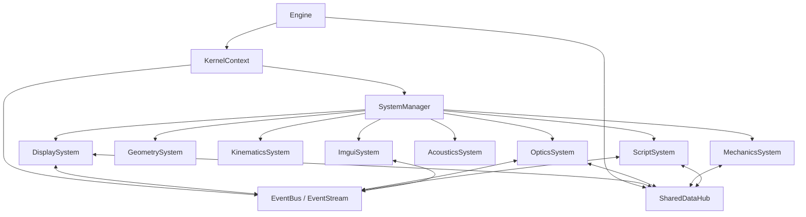
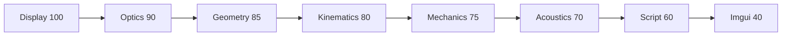
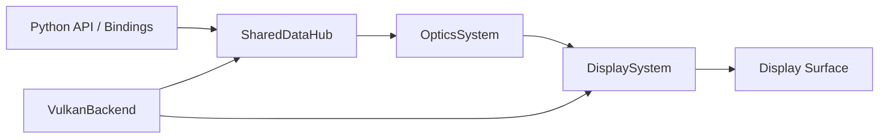
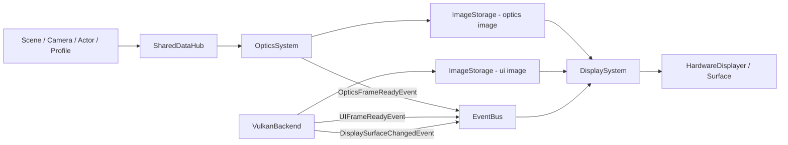
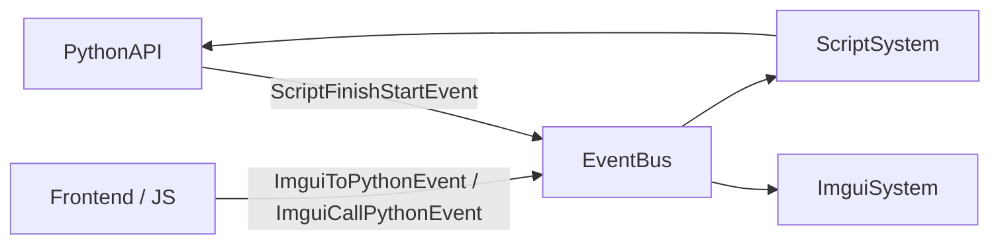
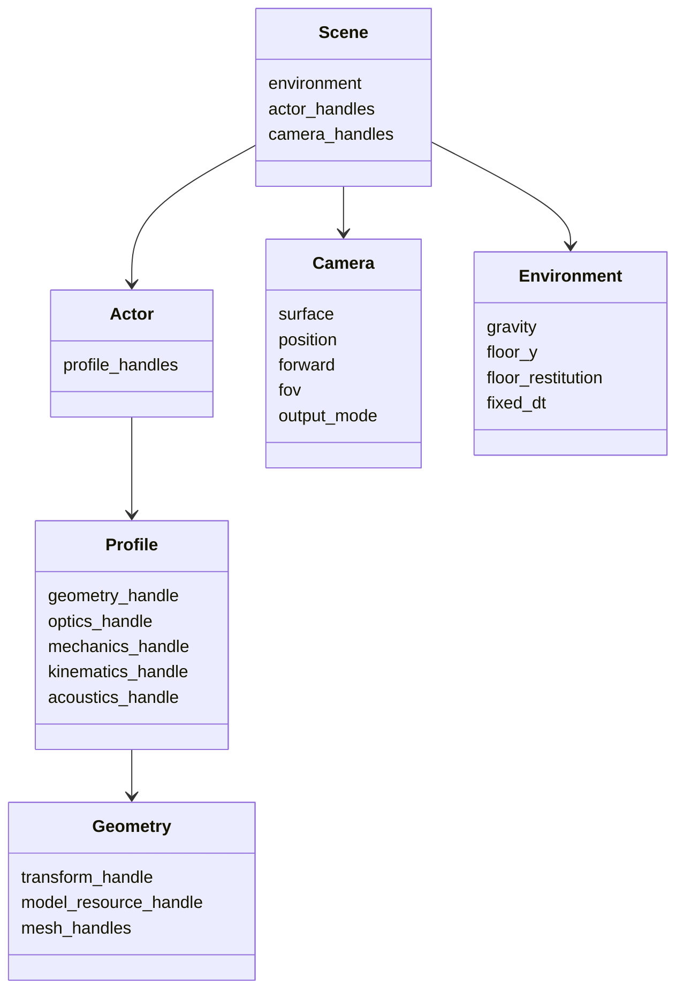
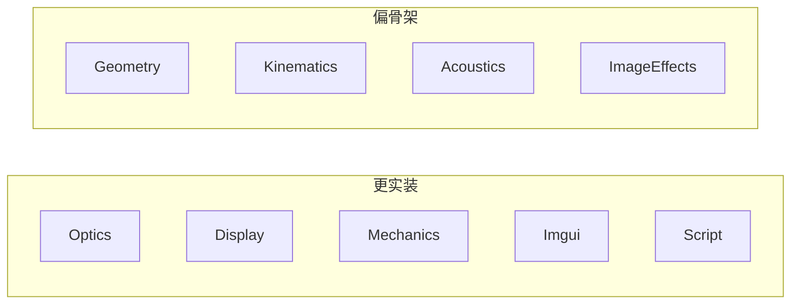

# CoronaEngine 架构图速览

## 1. 文档目的

前面的文档已经把项目的结构、系统职责、数据流、源码入口和能力状态说明得比较完整。本文件的目标不是再写一遍文字说明，而是把最重要的关系压缩成几张图。

适合使用场景：

- 第一次浏览项目时快速建立空间感
- 给团队成员解释系统关系
- 在开始深入阅读源码前先看一遍整体结构

## 2. 总体架构图

这张图要表达的核心点只有两个：

- `Engine + KernelContext` 是生命周期和服务中心
- 当前运行时的主结构是 `SystemManager + SharedDataHub + EventBus` 的组合

## 3. 系统优先级图

说明：

- 这是当前 `Engine::register_systems()` 中的实际注册顺序和优先级
- `ImguiSystem` 虽然也是系统，但它由主线程驱动，不是典型 `SystemBase` 独立线程系统

## 4. 主链路图

这是当前最值得记住的一条链路，也是整个仓库最实装的部分。

简化理解：

- Python/API 负责构造世界
- `OpticsSystem` 负责生成 3D 图像
- `VulkanBackend` 负责生成 UI 图像
- `DisplaySystem` 负责合成并显示

## 5. 渲染与显示详细链路图

这张图的重点在于：

- 图像数据本体不走事件，走 `ImageStorage`
- 事件只是通知“哪一帧准备好了”
- `DisplaySystem` 是 optics 和 UI 的汇合点

## 6. 脚本与 UI 联动图

这张图表达的是当前脚本链路的现实状态：

- `ScriptSystem` 主要承担 Python 运行入口和 UI 到 Python 的桥接
- Python 启动完成后会反过来影响 UI 显示时机

## 7. 运行时对象模型图

说明：

- 当前引擎的数据模型更像“对象图 + 句柄引用”，而不是经典 ECS archetype 形态
- 组件和运行时对象的真实存储位置在 `SharedDataHub`

## 8. 模块成熟度图

这不是评价高低，而是帮助阅读顺序排序：

- 想看“现在项目真正能做什么”，先看左边
- 想看“未来扩展点在哪里”，再看右边

## 9. 推荐如何配合使用这些图

建议顺序：

1. 先看本文件的 4 张主图
2. 再读 `docs/QUICK_START_cn.md`
3. 然后根据目标读 `docs/SYSTEMS_OVERVIEW_cn.md` 或 `docs/DATA_FLOW_OVERVIEW_cn.md`
4. 最后进入 `docs/SOURCE_INDEX_cn.md` 定位源码

## 10. 一句话结论

CoronaEngine 当前最核心的结构可以浓缩成一句话：用 `Engine + KernelContext` 管理生命周期，用 `SharedDataHub` 存世界，用 `Optics + UI + Display` 输出画面，用 `ScriptSystem` 把 Python 接到这条主链路上。