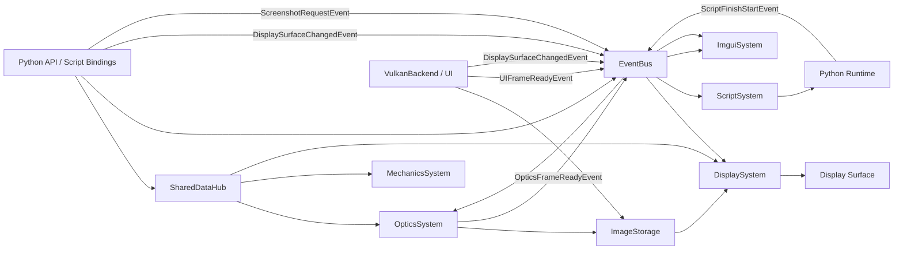

# CoronaEngine 数据流总览

## 1. 文档目的

本文档整理 CoronaEngine 当前代码中的核心数据流，重点回答三个问题：

- 运行时对象数据存在哪里。
- 各系统主要读写哪些共享数据。
- 渲染、显示、UI、脚本之间如何通过共享存储和事件协作。

本文以当前实现为准，核心依据包括：

- `include/corona/shared_data_hub.h`
- `src/systems/optics/optics_system.cpp`
- `src/systems/display/display_system.cpp`
- `src/systems/ui/vulk/vulkan_backend.cpp`
- `src/systems/script/script_system.cpp`
- `src/systems/script/python/corona_engine_api.cpp`
- `src/systems/script/python/python_api.cpp`

## 2. 核心结论

CoronaEngine 当前的数据流不是纯事件驱动，而是“共享数据中心 + 事件通知”混合模式：

- 结构化运行时对象主要放在 `SharedDataHub` 中。
- 系统之间的大量状态共享通过 handle + storage 完成。
- 事件总线主要用于“通知某件事发生了”，例如帧准备完成、截图请求、脚本启动完成。
- 图像帧是最典型的混合流：图像本体放在 `SharedDataHub::ImageStorage`，可消费时机通过事件发布。

## 3. SharedDataHub 的角色

`SharedDataHub` 是当前运行时数据中心，采用单例形式提供多类 storage。每类 storage 存放一种设备对象或运行时实体数据。

主要 storage 包括：

- `ModelResourceStorage`
- `ModelTransformStorage`
- `GeometryStorage`
- `KinematicsStorage`
- `MechanicsStorage`
- `AcousticsStorage`
- `OpticsStorage`
- `ProfileStorage`
- `ActorStorage`
- `CameraStorage`
- `EnvironmentStorage`
- `SceneStorage`
- `ImageStorage`

这些 storage 的共同特征是：

- 对象通过句柄分配和引用。
- 系统通过 `acquire_read()` / `acquire_write()` 访问数据。
- 系统间不直接持有重对象，而是通过 handle 连接数据关系。

## 4. 运行时对象关系

当前场景组织结构可以概括为：

`Scene -> Actor -> Profile -> {Geometry, Optics, Mechanics, Kinematics, Acoustics}`

同时：

- `Scene` 还持有 `Environment` 和多个 `Camera`。
- `Geometry` 持有 `ModelTransform` 与 `ModelResource` 句柄。
- `Optics`、`Mechanics`、`Kinematics`、`Acoustics` 都通过 `geometry_handle` 关联同一几何对象。

这意味着引擎当前的数据组织是“场景对象图 + 组件句柄引用”，而不是经典 ECS archetype 布局。

## 5. 数据创建入口

当前最重要的数据创建入口不是 C++ 系统本身，而是 Python API 暴露层。

从 `src/systems/script/python/corona_engine_api.cpp` 可以看出：

- `Scene` 会向 `scene_storage()` 分配对象。
- `Geometry` 会向 `geometry_storage()` 分配对象。
- `Optics` 会向 `optics_storage()` 分配对象。
- `Mechanics` 会向 `mechanics_storage()` 分配对象。
- `Actor` 会向 `actor_storage()` 分配对象。
- `Profile` 会向 `profile_storage()` 分配对象。
- `Camera` 会向 `camera_storage()` 分配对象。

因此当前主路径可以理解为：

1. Python 脚本或绑定 API 创建运行时对象。
2. 对象写入 `SharedDataHub`。
3. 各系统在自己的线程中读取这些 storage。
4. 系统再通过事件回传结果或触发后续动作。

## 6. 渲染主数据流

### 6.1 场景到渲染

`OpticsSystem` 每帧遍历：

- `scene_storage()`
- `camera_storage()`
- `actor_storage()`
- `profile_storage()`
- `optics_storage()`
- `geometry_storage()`
- `model_transform_storage()`

它会按 `Scene -> Camera -> Actor -> Profile -> Optics/Geometry` 的关系构建本帧渲染数据，包括：

- 相机矩阵
- Instance Table
- Material Table
- 各类 GPU buffer / image 绑定

这说明 `OpticsSystem` 当前是场景数据的主要消费者之一。

### 6.2 渲染结果输出

`OpticsSystem` 在初始化时会分配一个 `image_handle_` 到 `SharedDataHub::ImageStorage`。

每帧渲染完成后，它会：

1. 把最终图像和对应 `HardwareExecutor` 写回 `ImageStorage[image_handle_]`。
2. 如果当前相机绑定了显示表面，则发布 `OpticsFrameReadyEvent`。

该事件包含：

- `surface`
- `image_handle`
- `frame_index`
- `width`
- `height`

也就是说，事件本身不携带图像数据，只携带“去哪里取图”和“这是一帧新的图”的元信息。

## 7. UI 渲染数据流

UI Vulkan 后端的行为与 `OpticsSystem` 类似。

在 `src/systems/ui/vulk/vulkan_backend.cpp` 中：

- 初始化阶段会获取本地窗口句柄，保存为 `surface_`。
- 之后发布 `DisplaySurfaceChangedEvent`，通知显示系统建立对应表面。
- 同时分配自己的 `image_handle_` 到 `ImageStorage`。

在每次 `present_frame()` 时：

1. UI 把当前 `render_target` 和 `executor` 写入自己的 `ImageStorage` 条目。
2. 发布 `UIFrameReadyEvent`。

因此 UI 层和 Optics 层在输出结构上是一致的：

- 图像本体进入 `ImageStorage`
- 帧可用通知通过事件总线发布

## 8. 显示合成数据流

`DisplaySystem` 是渲染与 UI 的汇聚点。

它会订阅三类事件：

- `DisplaySurfaceChangedEvent`
- `OpticsFrameReadyEvent`
- `UIFrameReadyEvent`

其工作方式是：

1. 收到 `DisplaySurfaceChangedEvent` 后记录 surface，延迟创建 `HardwareDisplayer`。
2. 收到 `OpticsFrameReadyEvent` 后记录该 surface 对应的 optics 图层元数据。
3. 收到 `UIFrameReadyEvent` 后记录该 surface 对应的 UI 图层元数据。
4. 在自己的 `update()` 中，从 `ImageStorage` 通过 handle 取出两层图像。
5. 使用 GPU 合成管线把 optics 层和 UI 层混合为最终图像。
6. 将合成结果提交给 `HardwareDisplayer`。

这里有一个关键同步点：

- 生产者系统把 `executor` 写进 `ImageStorage`
- `DisplaySystem` 在合成前等待生产者 executor 完成
- 合成完成后把 `consumed_executor` 回写给图像条目
- 生产者下一次覆写图像前会等待 `consumed_executor`

这是一套明确的 GPU 读写同步协议，用来避免显示系统读图时，生产者同时写图导致竞争。

## 9. 脚本与运行时对象数据流

当前 Python API 与引擎核心数据结构是强绑定的。

Python 侧对象操作并不是维护独立副本，而是直接读写 `SharedDataHub` 中的存储对象。例如：

- 设置 Camera surface，本质是写 `camera_storage()`，并触发 `DisplaySurfaceChangedEvent`
- 请求截图，本质是发布 `ScreenshotRequestEvent`
- 创建 Scene/Actor/Profile/Geometry，本质是向对应 storage 分配和写入对象

这意味着：

- Python API 是当前最重要的“运行时世界构造入口”
- `SharedDataHub` 是 Python 和各系统共享的单一事实来源

## 10. 脚本事件流

当前脚本链路大致如下：

1. `ScriptSystem` 持有 `PythonAPI`。
2. `ScriptSystem::update()` 中调用 `python_api_->runPythonScript()`。
3. Python 初始化成功后，`PythonAPI` 会缓存 Python 侧 `run` 和 `deal_func_from_js` 回调。
4. 初始化后立即触发一次 `run()`，然后发布 `ScriptFinishStartEvent`。
5. `ImguiSystem` 订阅 `ScriptFinishStartEvent`，收到后显示 SDL 窗口。
6. `ScriptSystem` 订阅 `ImguiToPythonEvent` 和 `ImguiCallPythonEvent`，收到后获取 GIL 并调用 Python 回调。

这条链路说明：

- Python 启动会影响 UI 显示时机。
- UI 和脚本之间当前通过事件总线桥接。
- 这部分仍是过渡架构，未来大概率会进一步解耦。

## 11. 截图数据流

截图链路是一个比较完整的“请求-处理-回传”例子：

1. Python 或 Camera API 调用 `save_screenshot()` 或 `save_screenshot_sync()`。
2. API 发布 `ScreenshotRequestEvent`，携带 `camera_handle`、输出路径和可选 promise。
3. `OpticsSystem` 订阅该事件，把请求加入待处理队列。
4. 在随后的渲染流程中，`OpticsSystem` 根据 camera 匹配并处理截图。
5. 同步截图则通过 promise/future 返回处理结果。

这条链路体现了当前事件系统更适合“命令/请求通知”，而大块状态仍放在共享存储中。

## 12. 一张图理解当前数据流

## 13. 当前架构特点与代价

当前数据流设计有几个明显优点：

- 系统边界相对清晰，读写对象集中。
- Python API 可以直接构造运行时对象，调试和原型开发效率高。
- 图像帧流转采用 storage + event + executor 的组合，工程上比较实用。

同时也有几个代价：

- `SharedDataHub` 成为高耦合中心，系统很容易通过它互相“间接耦合”。
- 许多关键流程依赖 handle 和外部约定，需要文档辅助理解。
- 目前部分系统尚未形成完整消费/更新逻辑，数据模型先于系统能力存在。
- 脚本系统与 UI 之间仍带有过渡期桥接痕迹。

## 14. 一句话结论

CoronaEngine 当前的核心数据流可以概括为：Python/API 负责构造世界，`SharedDataHub` 负责存放世界，系统线程负责消费和更新世界，事件总线负责通知帧完成、请求到达和阶段切换。