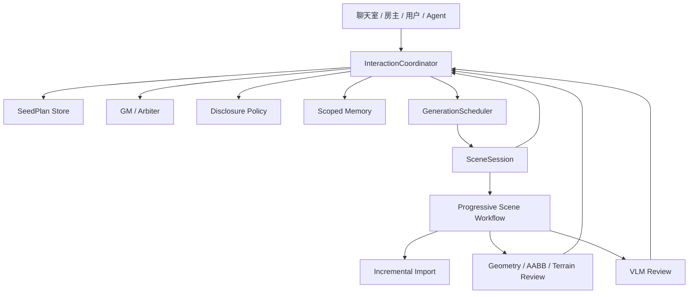

# 多人 / 多 Agent 链路稳定化终极计划

## 1. 问题本质判断

本项目当前要解决的不是单个 Agent 能力不足，而是复杂人机交互链路缺少一个稳定、可验证、可回放的控制平面。

目标链路是：

多人讨论 -> 多 Agent 参与澄清 -> GM 提炼模糊意图 -> 房主确认 Seed Plan -> 分批生成 -> 用户/Agent 在批次间动态介入 -> 几何/VLM 审查 -> 最终调整 -> 场景落盘。

当前真实短板集中在六类问题：

- 多人、多 Agent、房主、GM、生成执行之间缺少统一协调者。
- 聊天消息可能直接触发生成，或确认后再次被自然语言分类为 chat。
- progressive compose 已能分批导入，但批次边界、用户介入、修复请求和最终调整没有统一协议。
- 资源调度仍存在后台线程、ThreadPoolExecutor、下载/导入不可控等问题，容易资源溢出。
- 记忆作用域不足，不能稳定区分 room、agent、batch、actor。
- UI 缺少对用户友好的阶段披露，既不能缓解等待焦虑，也不能保护内部链路信息。

本轮目标不是做完整产品级平台，但要达到 UbiComp 研究 demo 级质量：主链路稳定、交互可解释、批次生成可介入、失败可诊断、实验可复现。

## 2. 当前核实状态

### 2.1 工程状态

- 当前分支：`feature/scene-assembly-v2`
- 最新 commit：`fa34b838 fix(image): grsai -> DMX GPT Image 2 图像生成接入`
- 工作区存在未跟踪目录/文档：`.tmp/`、`temp/`、`docs/复杂人机交互链路稳定化改进方案.md`
- 最新实测日志：`build/examples/engine/RelWithDebInfo/logs/2026-06-18_03-02-09_corona.log`

### 2.2 CodeGraph 查看 / 读取 / 写入代码绝对优先铁律

本节替代早先关于 CodeGraph 不可作为本轮依据的判断。该旧判断作废；后续所有涉及代码理解、定位、读取、改写和影响面判断的工作，都必须把 CodeGraph 作为第一入口。

当前工程根为 `E:\corona\CoronaEngine`，该目录下存在 `.codegraph/`，且 CodeGraph CLI 已恢复可用。本轮已重新验证：

- CLI `codegraph.cmd status/query/explore/node --path E:\corona\CoronaEngine` 能正常返回当前源码、调用关系、依赖面和 blast radius。
- Codex MCP 配置已固定为 `args = ["serve", "--mcp", "--path", "E:\\corona\\CoronaEngine"]`，避免再次落到外层 `E:\corona`。
- 本次修复过程中曾停止旧 CodeGraph MCP 进程，当前会话内 MCP transport 可能需要重开会话/重载 Codex 后才能热恢复；在此之前使用 CLI 作为等价降级入口。
- 若 PowerShell 直接调用 `codegraph` 命中 `codegraph.ps1` 执行策略限制，统一改用 `codegraph.cmd`，不因此跳过 CodeGraph。

结论：后续凡涉及代码理解、代码定位、代码查看、代码读取、代码写入、代码改写、影响面判断、调用链判断、测试覆盖判断，必须绝对优先使用 CodeGraph。这不是建议项，而是本计划的代码操作门禁：未先通过 CodeGraph 查看目标代码、确认调用关系和影响面，不允许直接进入读写代码步骤。`rg`、普通文件读取、直接打开文件只能作为 CodeGraph 明确不可覆盖时的降级手段；不能因为熟悉某个文件路径就绕过 CodeGraph。

执行优先级固定为：MCP CodeGraph > CLI `codegraph.cmd` > 普通文件工具。任何代码读写、协议调整、测试补充、影响面判断，都不得直接跳到普通文件工具；只有 CodeGraph 明确不索引目标材料，或 MCP 与 CLI 同时不可用，才允许降级，并必须在过程记录中说明降级原因。

强制执行顺序：

```powershell
# 1. 查看/读取/修改代码前，绝对优先走 MCP CodeGraph
codegraph_explore(projectPath="E:/corona/CoronaEngine", query="<问题 / 符号 / 文件名>")
codegraph_node(projectPath="E:/corona/CoronaEngine", file="<file>", symbol="<symbol>", includeCode=true)

# 2. MCP 临时不可用时，使用 CLI 等价入口
codegraph.cmd explore "<问题 / 符号 / 文件名>" --path E:\corona\CoronaEngine
codegraph.cmd node <symbol-or-file> --path E:\corona\CoronaEngine

# 3. 修改代码后，同步索引
codegraph.cmd sync E:\corona\CoronaEngine
```

执行约束：

- 读代码前：先用 `codegraph_explore` / `codegraph_node` 获取目标符号、源码片段、调用路径、依赖面和相关测试；CodeGraph 返回的源码视为已读取，不再重复用普通文件工具打开同一段代码。
- 写代码前：先用 CodeGraph 确认目标符号的 callers/callees、blast radius、共享模块边界和可能误伤的单人链路。
- 写补丁前：先在 CodeGraph 结果中明确本次要改的文件、函数/类、协议字段或测试入口；若 CodeGraph 无法覆盖目标文件，必须在记录中说明“CodeGraph 不索引该材料”后再降级。
- 改代码后：凡新增/修改 Python、前端或核心协议文件，执行 `codegraph.cmd sync E:\corona\CoronaEngine`；同步失败时记录为工具问题，但不能假装索引已更新。
- 只有文档、日志、Markdown、临时输出、纯配置等 CodeGraph 不索引或不适合索引的材料，才直接使用普通文件工具读取。
- 若 MCP 不可用但 CLI 可用，必须使用 `codegraph.cmd`；若 MCP 与 CLI 都不可用，才允许临时退回 `rg` / `Get-Content`，并在结论中标注“CodeGraph 降级读取”。
- 禁止在未使用 CodeGraph 了解影响面的情况下直接改多人、多 Agent、调度、Seed Plan、WorkflowState、记忆、披露、GM、生成链路相关代码。

### 2.3 日志暴露的关键问题

最新日志显示 progressive generation 已能跑出批次，例如：

- `r1_INTERIOR`
- `r1_BOUNDARY`
- `r1_OBJECTS_b1`
- `r1_OBJECTS_b2`

但动态介入失败明显：

- “天使雕塑呢”被归为 `chat`
- “那帮我补上”被归为 `chat`
- “雕塑跟地面穿模了”被归为 `chat`
- “执行错方案”被归为 `chat`

这说明当前系统没有把用户后续消息稳定路由为 batch intervention、repair request、pause/replan 或 final adjustment。

资源侧也有实测风险：

- 日志出现 `ThreadPoolExecutor-*`
- Hunyuan/Rodin 下载存在后台线程路径
- 多 peer 断开后仍继续本地生成，后续 actor broadcast 可能没有同步目标

## 3. 推荐目标架构

采用第一版目标架构：以 `InteractionCoordinator` 作为 Harness Coordinator，收口多人、多 Agent、Seed Plan、GM、批次生成和动态介入。

### 3.1 目标架构图

下面先给出纯文本架构图，保证在不支持 Mermaid 的编辑器里也能直接看到整体结构：

```text
┌────────────────────────────────────────────────────────────────────┐
│                    多人聊天室 / 房主 / 用户 / Agent                 │
│        模糊意图讨论、补充要求、冲突表达、确认/暂停/继续指令          │
└───────────────────────────────┬────────────────────────────────────┘
                                │
                                v
┌────────────────────────────────────────────────────────────────────┐
│ InteractionCoordinator 作为 Harness Coordinator                    │
│ - 收口多人消息、Agent 回复、房主确认、批次事件、审查结果             │
│ - 维护 room / plan / session / batch / intervention 状态            │
│ - 禁止聊天直接触发生成，必须先形成并确认 SeedPlan                   │
└───────┬──────────────┬──────────────┬──────────────┬────────────────┘
        │              │              │              │
        v              v              v              v
┌──────────────┐ ┌──────────────┐ ┌──────────────┐ ┌──────────────────┐
│ SeedPlan     │ │ GM / Arbiter │ │ ScopedMemory │ │ DisclosurePolicy │
│ 方案草案/确认 │ │ 提案/澄清/仲裁 │ │ 记忆隔离/摘要 │ │ UI阶段披露/权限 │
└──────┬───────┘ └──────┬───────┘ └──────┬───────┘ └────────┬─────────┘
       │                │                │                  │
       └────────────────┴────────────────┴──────────────────┘
                                │
                                v
┌────────────────────────────────────────────────────────────────────┐
│ GenerationScheduler                                                │
│ prepare / submit / poll / download / postprocess / import           │
│ 统一排队、限流、暂停、取消、abandoned、背压和状态上报                │
└───────────────────────────────┬────────────────────────────────────┘
                                │
                                v
┌────────────────────────────────────────────────────────────────────┐
│ SceneSession + Progressive Scene Workflow                           │
│ 按批次生成：室内 / 室外 / 混合场景；在 batch boundary 接收介入         │
└──────────────┬───────────────────────────────┬─────────────────────┘
               │                               │
               v                               v
┌──────────────────────────────┐   ┌─────────────────────────────────┐
│ Incremental Import            │   │ Geometry / AABB / Terrain Review │
│ 只增量写入，不清空场景         │   │ 比例、摆放、接地、穿模检查        │
└──────────────┬───────────────┘   └──────────────┬──────────────────┘
               │                                  │
               v                                  v
┌──────────────────────────────┐   ┌─────────────────────────────────┐
│ Engine Scene / Actors         │   │ VLM Review                       │
│ actor_id / version / batch_id │   │ 风格一致性、语义缺失、视觉异常    │
└──────────────┬───────────────┘   └──────────────┬──────────────────┘
               │                                  │
               └──────────────┬───────────────────┘
                              v
┌────────────────────────────────────────────────────────────────────┐
│ 回流 InteractionCoordinator                                         │
│ 形成 repair intervention / next-batch intervention / final adjustment│
└────────────────────────────────────────────────────────────────────┘
```

Mermaid 版本如下，支持 Mermaid 的阅读器可以直接渲染成图：



核心原则：

- 普通聊天不能直接触发生成，必须先形成 `SeedPlan`。
- 房主确认的是结构化计划，不是把自然语言再次喂给 MasterAgent 分类。
- `InteractionCoordinator` 是多人链路唯一控制面。
- `SceneSession` 保留为生成执行会话，不承担多人协作决策。
- GM 负责提案、澄清、仲裁和节奏控制，不直接越权执行。
- 用户介入默认作用于下一批次、当前安全边界后的修正，或最终调整。
- VLM 先作为审查与建议，不作为所有生成的唯一硬阻塞；缺失或非法置信度的 VLM 建议按低置信处理，只披露为待确认/advisory，不自动进入 actionable/final adjustment。
- UI 只披露阶段、进度、可介入窗口和待确认项，不泄漏内部 Agent 链路、prompt 和工具细节。

## 4. 核心模块设计

### 4.1 InteractionCoordinator

新增 `editor/plugins/AITool/services/interaction_coordinator.py`。

职责：

- 接收 LANChat 消息、Agent 回复、房主确认、批次事件、VLM/几何审查结果。
- 维护 room/session/plan/batch/intervention 状态。
- 将多人讨论提炼为 `SeedPlan`。
- 将用户介入路由到 pending intervention、repair request、pause/replan 或 GM conflict resolution。
- 向 scheduler 提交 confirmed generation job。
- 向 UI 输出 disclosure event。

建议接口：

```python
class InteractionCoordinator:
    def ingest_message(self, message: ChatMessage) -> CoordinatorEvent: ...
    def propose_seed_plan(self, room_id: str) -> SeedPlan: ...
    def confirm_seed_plan(self, plan_id: str, host_id: str) -> ConfirmResult: ...
    def execute_confirmed_plan(self, plan_id: str) -> GenerationJobRef: ...
    def ingest_intervention(self, intervention: InterventionRequest) -> InterventionDecision: ...
    def ingest_batch_event(self, event: BatchEvent) -> CoordinatorEvent: ...
    def ingest_review_result(self, result: ReviewResult) -> list[CoordinatorEvent]: ...
```

本轮已补齐协议层回流入口：

- `BatchEvent`：承载 `room_id / plan_id / session_id / batch_id / stage / progress / intervention_window_open`。
- `BatchEvent.metadata` 只允许安全批次字段进入控制面输出，例如 `batch_index / batch_total / status_message / asset_count / imported_count`；`prompt/provider/job_id/session_id/runtime_context/scheduler_updates/hidden_debug_ref` 等内部生成、调度和调试字段必须在 `BatchEvent.as_dict()` 边界清洗。
- `ReviewResult`：承载 `review_type / passed / findings / finding_details / actor_id / actor_version / severity`，其中 `finding_details` 保留 VLM/几何审查的结构化目标、动作、旋转/缩放建议和修复提示；当顶层 `actor_id` 缺失时，Coordinator 会从 `finding_details.actor_id / target_actor_id / object_id / target_object_id` 派生对象归因，避免最终调整阶段重新从自然语言中猜目标。
- `ReviewResult` 的结构化输出必须保留可执行修正字段，但过滤内部审查与调度字段：`prompt/provider/job_id/session_id/runtime_context/scheduler_updates/vlm_raw/hidden_debug_ref` 不进入 Coordinator event、pending intervention 或 final adjustment plan，避免 VLM/几何审查原始链路污染后续 Agent 上下文。
- `BatchEvent` / `ReviewResult` 必须通过 Coordinator 归属校验：`plan_id` 必须存在，`room_id` 必须匹配 SeedPlan；当回调携带 `session_id` 时，还必须匹配 Coordinator 当前 active execution session。未知 plan、跨房间错投或旧执行会话回流的异步回调只记录拒收事件，不写 scoped memory、不发 UI disclosure、不创建 intervention，避免旧批次/VLM 回调打开错误介入窗口或污染最终调整。
- 批次边界打开时，Coordinator 对 UI 披露为“可介入窗口”，不暴露内部 batch stage 名。
- 几何/VLM 审查失败时，Coordinator 转换为结构化 `InterventionRequest`，由统一介入队列处理。
- `SceneSession` 已新增结构化 `progress_event_sink`，可在 phase start/done/paused 时输出安全 progress event。
- `SceneSession` 的结构化 progress event 在源头清洗：`progress_timeline` 与 `progress_event_sink` 都只保留 `phase/status/percent/batch_index/batch_total/asset_count/imported_count/user_message` 等安全字段，过滤 prompt/provider/job/session/runtime/scheduler/debug 等内部字段；Coordinator 的 BatchEvent 清洗是第二道防线。
- `run_progressive_workflow()` 与 `SceneComposer.compose()` 已预留 `interaction_coordinator / room_id / plan_id / session_id` 可选参数，用于真实生成时绑定 Coordinator。
- `run_progressive_workflow()` 已将 AABB 未解决问题和 VLM actionable advice 转换为 Coordinator `ReviewResult`，并把 `actor_id / target_hint / action / rotation_correction / scale_correction / fix_suggestion` 等结构化审查详情传入 Coordinator。

### 4.2 SeedPlan

新增 `editor/plugins/AITool/services/seed_plan.py`。

`SeedPlan` 是生成前置协议，必须先于场景生成存在。

字段至少包含：

- `plan_id`
- `room_id`
- `host_id`
- `status`: `draft | clarifying | proposed | confirmed | executing | paused | completed | cancelled`
- `scene_type`: `indoor | outdoor | mixed`
- `participants`
- `intent_summary`
- `conflicts`
- `style_constraints`
- `spatial_constraints`
- `asset_constraints`
- `placement_constraints`
- `batch_goals`
- `review_policy`
- `confirmed_by`
- `version`

约束：

- `confirmed` 后不可原地修改，只能追加 intervention 或创建新 version。
- `review_policy` 对外输出必须走安全清洗：保留 `conflict_resolutions / clarification_requests / clarification_answers` 等业务字段，过滤 prompt/provider/job/session/runtime/scheduler/debug 等内部链路字段，避免方案确认 payload 或披露 metadata 泄漏模型/调度上下文。
- 所有生成任务必须引用 `plan_id` 和 `plan_version`。
- 最后 1-2 轮明确介入在最终调整中优先级高于早期宽泛偏好，但必须记录取舍原因。

### 4.3 InterventionRequest

用于批次生成过程中的增删改和纠错。

字段至少包含：

- `intervention_id`
- `room_id`
- `plan_id`
- `session_id`
- `batch_id`
- `actor_id`
- `actor_version`
- `source_user_id`
- `intent_type`: `add | remove | modify | repair | style_adjust | conflict | wrong_plan`
- `content`
- `priority`
- `apply_policy`: `current_safe_boundary | next_batch | final_adjustment | pause_and_replan`
- `finding_details`: 只保留可执行修正字段，例如 position/rotation/scale correction、fix suggestion、target/action/confidence；直接介入、ReviewResult 转介入和最终调整摘要都必须过滤 prompt/provider/job/session/runtime/scheduler/debug 等内部字段。

### 4.4 DisclosureEvent

用于 UI 信息披露。

字段至少包含：

- `event_id`
- `room_id`
- `audience`: `host | participant | agent | gm`
- `stage`
- `progress`
- `public_message`
- `available_actions`
- `requires_confirmation`
- `metadata`（只允许安全业务字段）

原则：

- UI 展示 `public_message/progress/actions`。
- 内部 prompt、Agent 私有推理、工具链细节、`hidden_debug_ref` 只允许留在服务端诊断对象或日志引用中，不进入 `as_dict()` 广播 payload、聊天室正文或前端 disclosure 状态。

### 4.5 Scoped Memory

新增显式记忆作用域：

- `room_id`
- `plan_id`
- `agent_id`
- `batch_id`
- `actor_id`

多人链路禁止隐式使用全局 `scene_id="default"`。

本轮服务层先落地 `MemoryScopeStore`，由 Coordinator 写入可查询摘要：

- 用户意图摘要
- 冲突摘要
- 已确认约束
- 最近 1-2 轮强介入
- 已生成 actor 摘要
- 审查/修复状态

生成时注入结构化摘要，不注入完整聊天室历史。

## 5. 实施节奏

采用最后一版实施节奏：先控制面，再批次介入，再资源调度，再信息披露和记忆隔离，最后增强 GM、VLM 与质量闭环。

### 阶段 A：Coordinator + SeedPlan 收口

目标：解决“聊天直接触发生成”和“确认后再次被分类成 chat”的根因。

改动：

- 新增 `interaction_coordinator.py`
- 新增 `seed_plan.py`
- 调整 `lanchat_agent_orchestrator.py`：降级为 GM/role agent 语义服务，不再拥有最终流程控制权。
- 调整 `lanchat_host_action_executor.py`：确认后调用结构化 `execute_confirmed_plan(plan_id)`，不再拼自然语言调用 agent。
- 保留单人稳定路径；多人房间路径强制走 Coordinator。

验证：

- 新增 `test_seed_plan.py`
- 新增 `test_interaction_coordinator.py`
- 扩展 host executor/orchestrator 测试，确认 confirmed plan 不会再次进入 chat 分类。

### 阶段 B：批次生成协议与动态介入

目标：让“第一批生成后用户补充想法”进入后续批次，而不是被当成普通聊天。

改动：

- Coordinator 服务层已新增 `BatchEvent` 和 `ReviewResult` 回流协议。
- Coordinator 已支持 batch boundary 打开介入窗口，并记录 disclosure/memory。
- Coordinator 已支持 review fail 自动路由为 structured intervention。
- Coordinator 已对 batch/review 回流增加 plan/room/session 归属校验：未知 plan、room mismatch 或明确 `session_id` 与当前执行会话不匹配会被拒收，不进入 disclosure、memory 或 intervention。
- `SceneSession.progressive_compose()` 已支持结构化 progress event sink。
- `run_progressive_workflow()` 已可选绑定 Coordinator，把真实 phase 边界映射为 `BatchEvent`。
- `run_progressive_workflow()` 已自动把 AABB repair 未解决 issue 和 VLM advisory/actionable report 映射为 `ReviewResult`。
- `SceneSession.progressive_compose()` 通过结构化 progress event sink 暴露 phase 边界；`run_progressive_workflow()` 负责绑定 `plan_id/session_id` 到 Coordinator。
- Coordinator 监听 batch boundary、micro-batch boundary、final review boundary。
- 新增 `InterventionRequest` 与 `InterventionDecision`。
- Coordinator 已记录每个 confirmed SeedPlan 对应的 `GenerationJobRef`；当 `next_batch` 介入到达且 scheduler 支持 `update_job()` 时，会把 `latest_intervention / pending_interventions / intervention_revision` 下推到 queued generation job。Coordinator 的每 plan `GenerationJobRef` 已加最近窗口上限，避免长时间多批次实验中旧 job ref 让后续动态介入反复扫描过期任务；窗口内最新 job ref 仍会接收 future batch update。
- 下推只作用于尚未开始执行的后续任务；如果 scheduler 返回非 queued 或拒绝更新，介入仍保留在 Coordinator pending intervention 与 scoped memory 中，供后续批次或最终调整消费，避免和正在生成的当前批次竞争。
- `InterventionRequest` 已新增 `target_hint`，并从消息 metadata 的 `actor_id / target_actor_id / object_id / target_object_id` 或文本中的 `actor:xxx / object:xxx / #xxx` 提取强目标；自然语言“新增/删除/调整 xxx”会形成轻量目标提示，随 pending interventions 和 scheduler payload 下推。普通聊天直连 Worker 会解析 `metadata/metadata_json` 中的安全目标字段并透传给 Coordinator，Coordinator 对生成期介入优先采用显式 `metadata.target_hint`，避免用户点选对象后发出的“把这个摊位挪一点”退化成纯文本猜测。
- `SeedPlan` 已新增显式暂停状态转换：confirmed/executing plan 可进入 `paused`，用于“执行错方案/需要 GM 重提案”的控制面停顿。
- Coordinator 对 `pause_and_replan` 介入已接入 scheduler 控制：调用 `scheduler.pause_session(room_id)` 暂停后续批次，并把 `scheduler_control` 结果写入 `InterventionDecision.payload`。
- Coordinator 已新增 `propose_replan_from_paused(plan_id)`：只允许从 paused plan 派生新 SeedPlan 版本，把 pending interventions 与 GM note 注入新草案，进入 proposed 并等待房主确认；原 paused plan 不被原地修改。
- 重提案新版本确认执行时，Coordinator 会识别其 source paused plan，并在 submit 前调用 `scheduler.resume_session(room_id)`，避免新 plan 继续卡在旧 plan 留下的 paused session 中。
- 对日志中三类失败建立显式路由：
  - “补一个天使雕塑” -> `add` + `next_batch`
  - “雕塑跟地面穿模” -> `repair` + `geometry_review`
  - “执行错方案” -> `wrong_plan` + `pause_and_replan`

验证：

- 新增 `test_runtime_intervention_followup.py`
- 当前 `test_interaction_coordinator.py` 已覆盖 batch boundary -> intervention window、review fail -> geometry intervention。
- 当前 `test_interaction_coordinator.py` 已覆盖 next_batch intervention -> queued scheduler job payload/priority 更新。
- 当前 `test_interaction_coordinator.py` 已覆盖 next_batch intervention 的安全 disclosure 摘要：`scheduler_update_summary` 会进入 participant `可介入窗口` metadata，UI 可区分“已下推后续批次”和“只记录待处理”，但不会暴露 `scheduler_updates/job_id` 明细。
- 当前 `test_interaction_coordinator.py` 已覆盖增删改介入目标提取：metadata actor_id/actor_version 与文本目标提示会进入 pending intervention、scheduler payload 和最终调整冲突判断；`test_lanchat_agent_orchestrator.py` 已覆盖 Worker 普通聊天直连 Coordinator 时会从 `metadata_json` 透传安全 `actor_id/actor_version/target_hint`，并过滤 prompt/provider 等内部字段。
- 当前 `test_interaction_coordinator.py` 已覆盖 wrong_plan/pause_and_replan -> `scheduler.pause_session(room_id)` 与 SeedPlan `paused` 状态。
- 当前 `test_interaction_coordinator.py` 已覆盖 paused SeedPlan -> GM replan version -> host confirmation -> new plan scheduler submit。
- 当前 `test_interaction_coordinator.py` 已覆盖 replan confirmation -> `scheduler.resume_session(room_id)` -> new plan submit 的控制顺序。
- 当前 `test_seed_plan.py` 已覆盖 confirmed/executing SeedPlan 可暂停。
- 当前 `test_scene_session.py` 已覆盖结构化 progress event sink 与旧字符串进度 sink 并存。
- 当前 `test_scene_composer_progressive_geometry.py` 已回归真实 micro-batch 切分、pending notes 介入、progress 文案安全。
- 当前 `test_scene_composer_progressive_geometry.py` 已覆盖 AABB unresolved issue -> Coordinator ReviewResult、VLM actionable advice -> Coordinator ReviewResult，以及 VLM 外回路 composer 级 `vlm_target_provider / vlm_capture_fn / vlm_review_fn` 注入点；真实渲染链路后续可替换截图源/审查源，截图仍经 `EngineWriteGate.screenshot` 收口。
- 当前 `test_interaction_coordinator.py` 已覆盖未知 plan、跨房间 room mismatch、旧执行 session mismatch 的 `BatchEvent` 与 `ReviewResult` 会被拒收，不新增 disclosure、不写入 memory、不创建 pending intervention，防止异步旧回调污染当前房间或最终调整。
- 覆盖补充资产、穿模修复、执行错方案暂停重提案。
- 保证旧的 progressive geometry 测试不回归。

### 阶段 C：资源调度优化

目标：降低资源溢出，建立可观测、可取消、可暂停、可限流的生成队列。

本阶段以 `docs/ai-generation-scheduler-plan.md` 作为资源调度子方案的权威实现。终极计划中的 scheduler 只定义它和多人/SeedPlan/批次介入控制面的关系。

改动：

- 新增或强化 `generation_scheduler.py`，复用 `event_loop_runner.py`。
- 统一提交 `GenerationJob`，字段包含 `room_id/plan_id/session_id/batch_id/resource_class/priority/cancel_token`；其中 `room_id` 用于房间级资源收口、暂停、取消和 UI 诊断，`session_id` 用于单次 execution 的回调归属与旧异步回流拒收，二者不再混用。
- `GenerationJob` 区分可上报 `payload` 与运行时 `runtime_context`，Coordinator 等不可序列化对象不进入 public status。
- 新增 `generation_composer_adapter.py`，提供 `SceneComposerJobRunner`，作为 scheduler `compose` stage handler。
- `LANChatAgentWorker` 支持可选 `composer_factory`：传入后默认 scheduler 使用 `SceneComposerJobRunner` 执行 confirmed SeedPlan；不传时保持轻量 scheduler，避免无模型/单测环境误触真实生成。
- 新增 `generation_provider_adapter.py`，提供 `ProviderStageRunner`：把 provider 对象或 factory 的 `prepare/submit/poll/download/postprocess/import_result` 映射为 scheduler stage handler，作为 Hunyuan/Rodin/image 深层 provider 迁移入口。
- 同文件新增 `DeferredDownloadProvider`：把旧 provider 中的“延迟 mesh/rest 下载 callable”包装为 scheduler `download` stage，替代散落 daemon thread 的目标入口。
- `GenerationScheduler` 支持 per-job `stage_order/stage_handlers`：provider 工具可在单个 job 的 runtime context 中携带自己的 download handler，不要求全局 scheduler 预先注册所有 provider。
- `GenerationScheduler` 支持 queued job 的执行前更新：`update_job(job_id, priority=..., payload_updates=...)` 只允许修改尚未开始的后续批次，用于用户/GM 动态介入后调整后续 prompt、批次参数或优先级。
- `GenerationScheduler` 支持按 room 或 execution session 批量取消：`cancel_session(identifier, abandon_remote=False)` 会匹配 job 的 `room_id` 或 `session_id`，取消该房间/会话所有非终态 job，queued/paused job 立即释放队列压力，running job 在下一 scheduler 边界响应 cancel；当 room close 传入 `abandon_remote=True` 时，运行中 job 会保留 abandon 语义并最终进入 `abandoned`，用于房间关闭、peer 放弃或实验中止时避免本地生成继续无约束运行。
- `GenerationScheduler` 不再按纯 FIFO 执行 queued job；worker 被唤醒后从 pending set 中选择最高优先级任务，同优先级保持按创建时间先后执行。
- `GenerationScheduler` 的 queue backpressure 会同时计入 `queued` 与 `paused` job：暂停中的后续批次仍占用队列容量，避免 pause/replan 后继续无界接收新任务造成资源溢出。
- `GenerationScheduler.snapshot()` 保留为内部诊断快照：返回 thread/stop 状态、queue limit/pressure、paused sessions、status/stage counts、active jobs、queued jobs、recent events、concurrency/stage_order，以及稳定的 `diagnosis={state,reasons,recommended_actions,latest_queue_full_at}`；内部快照不包含 prompt、runtime_context、provider 对象或内部工具细节，但可保留 `job_id/session_id/plan_id/batch_id` 等控制标识用于调试与取消。
- `GenerationScheduler.public_snapshot()` / `public_session_snapshot()` 已新增 UI/聊天室安全投影：只保留资源聚合、状态/阶段摘要、`diagnosis` 与 recent event type 级信息，不暴露 `job_id/session_id/plan_id/batch_id/payload`，用于 resource disclosure 与前端阶段条。
- `GenerationScheduler` 已维护 bounded recent event log：记录 submit、queue_full、pause/resume、update、cancel_requested、status_change，用于资源溢出、暂停卡住、动态介入未生效等问题的实验复盘。
- `GenerationScheduler.shutdown()` 已收紧为调度器终止态：终止后 `submit()` 返回 payload-safe `rejected`，记录 `submit_rejected_after_shutdown` 安全事件，`diagnosis.state=stopped` 并给出安全 reason/action，不再通过 `ensure_running()` 清空 stop 状态并重新拉起 worker，避免实验 teardown 或 room 关闭后迟到任务重新积压资源。
- Rodin / Hunyuan `model_tools.py` 的 rest mesh 下载分支新增 scheduler 优先路径：注入 deferred download scheduler 时提交 `provider_deferred_download` job；未注入时保留旧 daemon thread 兼容，已注入但 scheduler 拒绝时尊重背压，不再绕过 scheduler 起线程。
- Quasar `ai_media_resource.registry` 新增 media task scheduler hook：图片/媒体异步生成任务可提交为 `media_resource_task` job；未注入时保留旧 `TaskExecutor` 兼容，已注入但 scheduler 拒绝时记录任务错误，不再 fallback 到 `TaskExecutor`。
- `LANChatAgentWorker` 创建或接收 `GenerationScheduler` 时，会把该 scheduler 安装到 Quasar `model_tools.set_deferred_download_scheduler()` 与 `ai_media_resource.registry.set_media_task_scheduler()`；worker stop 时仅清理自己安装的 scheduler hook。
- `LANChatAgentWorker.generation_scheduler_snapshot()` 已新增只读诊断入口：scheduler 已初始化时优先返回 public-safe snapshot；未初始化时返回 unavailable，不会为了诊断而新建 scheduler 线程。
- `LANChatAgentWorker.cancel_generation_session(session_id)` 已新增资源收口入口：上层关闭房间或中止实验时可委托 scheduler 取消该 room/session 的后续生成任务；未初始化 scheduler 时显式返回 unavailable，不隐式启动后台线程。
- `LANChatAgentWorker.handle_lanchat_room_event(event)` 已新增 LANChat 生命周期事件入口：收到 `room_closed / leave_room / left / stop_room / stopped / closed` 时，会按事件中的 room_id 或 worker 已见过的 active room 触发 `cancel_generation_session(..., abandon_remote=True)`；`member_update` 等非关闭事件不会误取消生成。Worker 的 active room 兜底注册表已改为有界 FIFO 窗口，避免多人/多房间长时间实验时为了关闭兜底无限保留历史 room_id。`process_once()` 已支持可选原生队列 `network_pop_lanchat_room_event()`，每 tick 有界消费 room lifecycle event，使真实 CEF/native 关闭房间事件具备 Python Worker 收口入口；原生 API 是否实际投递仍标 `[待 F5/实机验证]`。
- `LANChatAgentWorker` 已能把 scheduler snapshot 转换为安全 `action_status` disclosure：UI 只看到“资源调度”阶段、队列压力、排队数、活跃数、暂停会话数、recent event type 与 `diagnosis` 摘要，不暴露 job_id、prompt、provider 或 runtime_context。
- 按阶段拆分生成：
  - `compose`
  - `prepare`
  - `submit`
  - `poll`
  - `download`
  - `postprocess`
  - `import`
- 默认并发采用调度方案 A：
  - 图片提交：`4`
  - 模型提交：`2`
  - 模型轮询：`32`
  - 下载：`4`
  - 后处理：`1`
  - 引擎导入：`1`
- 所有控制入口通过 scheduler：
  - 暂停
  - 恢复
  - 取消
  - 跳过
  - 修改 prompt
  - 调整优先级
- 取消远端任务时，如果远端不支持 cancel API，本地标记为 `abandoned`，迟到结果忽略，不下载、不导入、不创建 Actor。

验证：

- 新增 `test_generation_scheduler.py`
- 覆盖排队、取消、失败重试、顺序执行、状态上报。
- 覆盖 `submit` token 在进入 `poll` 后释放。
- 覆盖 `cancel` 后不会进入 download/import。
- 覆盖 import 阶段严格串行。
- 覆盖 runtime context 不泄漏到 public payload。
- 覆盖 `SceneComposerJobRunner` 将 SeedPlan/Coordinator 上下文传入 `SceneComposer.compose()`。
- 覆盖配置了 `composer_factory` 的 `LANChatAgentWorker` 能把 confirmed SeedPlan 跑进 scheduler compose stage，并回流 batch intervention window。
- 覆盖 `ProviderStageRunner` 将 provider lifecycle 映射到 scheduler stage，累积阶段结果，且 runtime provider 不泄漏到 public payload。
- 覆盖 `DeferredDownloadProvider` 将 legacy download callable 放入 scheduler `download` stage，并受 download semaphore 限流。
- 覆盖 `GenerationScheduler` per-job stage handler：Rodin/Hunyuan 这类 provider 可把 download handler 随 job 提交。
- 覆盖 `GenerationScheduler` 高优先级 queued job 会先于低优先级 queued job 执行，支撑动态介入后优先处理后续关键批次。
- 覆盖 `GenerationScheduler.update_job()` 能在任务执行前更新 queued job 的 prompt/payload 与 priority；任务开始或完成后拒绝修改，避免和正在生成的批次竞争。
- 覆盖 paused job 仍参与 queue backpressure 计算。
- 覆盖 `GenerationScheduler.snapshot()` 能报告 paused backpressure、active stage、优先级队列顺序、recent events 和 payload-safe `diagnosis`，且不会泄漏 prompt/runtime object；覆盖 `public_snapshot()` / `public_session_snapshot()` 作为 UI/聊天室安全投影时不暴露 `job_id/session_id/plan_id/batch_id/payload`。
- 覆盖 scheduler recent events 能记录 queue_full、pause/resume、status_change 等关键资源调度事件，且不泄漏被拒绝或已提交任务的 prompt。
- 覆盖 `GenerationScheduler.shutdown()` 后迟到 `submit()` 会被拒绝，不重启 worker、不创建 job、不泄漏 prompt，并在 snapshot/recent events 中保留安全可诊断信号。
- 覆盖 `LANChatAgentWorker.generation_scheduler_snapshot()` 能把 scheduler public-safe 诊断面暴露给上层，且不泄漏 prompt、execution session、job id 或 plan id；未初始化时不会隐式启动 scheduler。
- 覆盖 `LANChatAgentWorker` 能把 scheduler snapshot 作为安全 resource disclosure 发到 `action_status`，且前端 disclosure 解析会保留 queue_pressure/queued_count/recent_event_types/diagnosis，过滤 job_id/prompt/runtime_context/stage_handlers。
- 覆盖 `LANChatAgentWorker` 安装并清理 deferred download / media task scheduler hook。
- 覆盖 media registry 在 scheduler hook 存在时把图片/媒体异步任务提交为 `media_resource_task`，并能通过 registry `resolve/get_status` 回读结果；覆盖 scheduler 拒绝/queue full 时不会 fallback 到 `TaskExecutor`，而是将媒体记录置为 error。
- Hunyuan/Rodin 真实线程完全收口标 `[待 F5/实机验证]`。

### 阶段 D：信息披露与 UI 阶段反馈

目标：让用户知道系统进行到哪里、什么时候能介入，同时不泄漏内部链路。

改动：

- 新增 `DisclosurePolicy`。
- 前端 `lanchat` store 提取安全 disclosure metadata，维护 `state.disclosures`。
- 前端 `RoomPanel` 显示当前阶段、进度、公开消息和可用动作；当阶段为“资源调度”且 metadata 带安全 `diagnosis` 时，会把 stopped/paused/saturated/strained/active 翻译为用户可读资源状态提示，不直接展示内部 reason/action 枚举。
- 兼容现有 `progress/action_status` 消息：没有完整 disclosure 对象时，也可从安全进度文本生成阶段条。
- `DisclosurePolicy` 已支持 `apply_policy=host_confirmation`：host 侧 `requires_confirmation=True`，可见动作包含 `confirm_conflict_resolution`，metadata 只暴露安全的 `proposal_id / requires_conflict_resolution` 等字段。
- UI 可见阶段：
  - `讨论中`
  - `方案整理中`
  - `等待房主确认`
  - `第 N 批生成中`
  - `可介入窗口`
  - `审查中`
  - `最终调整中`
  - `完成 / 需确认`
- 对不同 audience 输出不同视图：
  - host：冲突、待确认、批次状态、可暂停/继续
  - participant：自己的意图是否被采纳、当前阶段、可介入动作
  - agent：执行约束和必要摘要
  - gm：冲突摘要、仲裁候选、节奏建议
- 不在聊天室直接暴露 prompt、内部 Agent 分工、工具调用细节、完整日志。

验证：

- 新增 `test_disclosure_policy.py`
- 覆盖 host/user/agent/gm 在 draft、confirmed、generating、review 阶段看到的信息不同。
- 覆盖 host_confirmation intervention 会触发 host 确认态，且不泄漏内部 prompt/tool/provider。
- 新增 `lanchatDisclosure.test.mjs`
- 覆盖 disclosure metadata 白名单提取、内部 prompt/tool/provider/batch_id 防泄漏、嵌套 metadata 递归过滤、legacy progress 消息兼容，以及资源调度 `diagnosis` 与动态介入 `scheduler_update_summary` 安全摘要在前端 metadata 中保留。
- 前端轻量测试只验证数据协议和渲染入口；真实 CEF 表现标 `[待 F5/实机验证]`。

### 阶段 E：记忆管理隔离

目标：防止多人、多 Agent、跨批次上下文串味。

改动：

- 新增 `memory_scope.py`，提供 `MemoryScope / ScopedMemoryEntry / MemoryScopeStore`。
- Coordinator 记录 `discussion / seed_plan_confirmed / generation_started / intervention` 生命周期摘要。
- Coordinator 暴露 `memory_summary(room_id, plan_id, agent_id, batch_id, actor_id)`，为后续 GM/Agent/SceneComposer 注入结构化上下文；当目标 actor 明确时，可只回放该对象的跨批次介入摘要，避免同一批次其他对象的要求串入生成 prompt。
- 多人链路逐步禁止隐式 `scene_id="default"`；旧单人/场景 `MemoryManager` 不强拆，但新增 `make_memory_scope_id()` / `get_scoped_memory_manager()`，让 legacy 入口也能按 scene/room/plan/batch/agent 显式分桶。
- 旧 `AgentCoordinator` 与 `MasterAgent` 已接入 legacy scoped memory：`LANChatAgentOrchestrator` 调用角色 Agent 时注入内部链路上下文，`MasterAgent` 写入 `scene_state.metadata`，旧 `AgentCoordinator` 读取/写入相似操作记忆时优先按 room/plan/batch/agent 分桶；无链路上下文时保持单人/default 行为。
- 生成时注入结构化摘要，不注入完整聊天室历史。

验证：

- 新增 `test_memory_scope.py`
- 覆盖两个房间之间记忆不串。
- 覆盖同房间不同 agent 私有记忆不串，同时允许读取共享计划摘要。
- 覆盖旧 `MemoryManager` 的 scoped wrapper：scope id 稳定、跨房间不串、按 scope reset 不影响其他房间。
- 覆盖旧 `AgentCoordinator` 的相似操作 recall 使用 room scoped memory；覆盖 `MasterAgent` 能解析 Orchestrator 注入的 LANChat memory scope。
- 覆盖 Coordinator 在讨论、确认、执行、介入阶段写入作用域摘要。
- Coordinator 协议层已覆盖最终调整摘要：最近 1-2 批强介入、VLM/几何问题优先，早期低优先级介入进入 deferred；SceneSession FinalReview 已能消费该摘要、执行轻量 layout transform/status 收尾修复并生成用户可见报告，真实 engine actor 落盘仍需 `[待 F5/实机验证]`。

### 阶段 F：GM 仲裁与质量闭环

目标：让 GM 真正承担多人讨论把控、冲突仲裁、节奏控制，而不是变成另一个隐式执行器。

改动：

- GM action schema：
  - `PROPOSE_SEED_PLAN`
  - `REQUEST_CLARIFICATION`
  - `RESOLVE_CONFLICT`
  - `PAUSE_AFTER_BATCH`
  - `APPLY_INTERVENTION_TO_NEXT_BATCH`
  - `REQUEST_REVIEW`
  - `REQUEST_FINAL_ADJUSTMENT`
- 冲突处理规则：
  - 用户之间冲突：GM 给候选方案，host 确认。
  - 用户介入和当前批次冲突：默认进入下一批次或 final adjustment。
  - 早期偏好和最后 1-2 轮明确介入冲突：后者优先，但需记录原因。
- Coordinator 新增讨论阶段冲突候选决议协议：
  - `propose_conflict_resolution(plan_id)`：GM 只能生成候选决议，不直接修改 confirmed plan 或触发生成。
  - `confirm_conflict_resolution(proposal_id, host_id)`：只有房主确认后，决议才写入 `SeedPlan.review_policy.conflict_resolutions`。
  - `reject_conflict_resolution(proposal_id, host_id)`：房主拒绝 GM 候选后，候选状态写为 `rejected` 并进入 `review_policy.conflict_resolutions` 留痕，但不会被视为已解决冲突；后续 `confirm_seed_plan(plan_id)` 仍会阻断，直到 GM 重新提案并由房主确认。
  - `confirm_seed_plan(plan_id)`：若 `SeedPlan.conflicts` 中存在未被 confirmed conflict resolution 的 `conflict_items` 覆盖的冲突，直接返回失败并要求先完成 GM 候选决议与房主确认；一个确认决议可覆盖多个冲突项。
  - 重复确认同一个 `proposal_id` 是幂等的：更新已有 resolution，不重复追加，避免房主重复点击或消息重放污染 `review_policy`。
  - 已冻结/执行中的 SeedPlan 不允许再确认讨论阶段冲突决议，避免绕过 SeedPlan 确认边界。
  - Host disclosure 会显式提供 `confirm_conflict_resolution / reject_conflict_resolution / request_clarification / pause_discussion`，前端/聊天室可通过 `cr-...` correlation id 发送结构化确认/拒绝；Orchestrator 会产出 `conflict_resolution_confirmation` 的 coordinator-only payload，Worker 只回写 Coordinator，不进入 HostExecutor 或 native 写场景队列。
- Coordinator 新增 GM 节奏控制协议：
  - `control_pace(room_id, action, actor_id, note)`：GM 的暂停、继续、先讨论不再只停留在旧 orchestrator runtime mode，而是进入 Coordinator 事件、scoped memory、DisclosurePolicy 和 scheduler pause/resume。
  - `pause / discuss` 会将 active SeedPlan 置为 `paused`，保存暂停前状态，并调用 `scheduler.pause_session(room_id)`；`resume` 会恢复暂停前状态并调用 `scheduler.resume_session(room_id)`。
  - Worker 收到 `@GM 暂停 / 继续 / 先讨论` 且不带 proposal id 时，优先走 Coordinator 控制面并回发安全 `action_status` disclosure；旧 orchestrator 的 GM 控制只作为降级路径。
- Coordinator 新增 GM 澄清协议：
  - `request_clarification(room_id, question, requested_by, target_user_id, target_hint)`：GM 的澄清问题进入 SeedPlan `clarifying` 状态、`review_policy.clarification_requests`、scoped memory 和 disclosure，而不是只作为一条普通聊天。
  - `confirm_seed_plan(plan_id)` 会阻止仍存在 pending clarification 的方案确认，避免房主误触发把模糊需求直接推进到生成。
  - 用户/房主回答澄清问题后，Coordinator 会记录 `clarification_answered`，回填 `review_policy.clarification_answers`，并在无 pending clarification 时允许方案继续 proposed/confirmed。
  - Worker 收到 `@GM 澄清 / 问清楚 / 需要补充` 且不带 proposal id 时，优先走 Coordinator 澄清协议，不调用模型 Agent。
- Coordinator 新增 `final_adjustment_plan(plan_id)`：基于 pending interventions、最新 batch index、介入优先级和 review 结果生成最终调整候选集、deferred 列表和冲突提示。
- `SceneSession.progressive_compose()` 新增 `final_adjustment_provider`，在 FinalReview 前消费 Coordinator 摘要；`FinalReviewReport` 会携带 `final_adjustments / deferred_interventions / conflicts` 并生成用户可见说明。
- `SceneSession.apply_final_adjustments()` 新增轻量收尾修复算子：对明确 actor 的 selected final adjustments 执行缩小、贴地、mark stale 等 deterministic layout 修改；冲突 actor 只进入确认提示，不静默执行；当 final adjustment 携带 `actor_version` 且当前 LayoutInstance metadata 中的版本不同，会跳过自动执行并记录 `skipped_actor_version_mismatch`，避免旧版本介入在最终阶段误改已被后续批次/用户更新过的对象。
- 质量闭环：
  - AABB/terrain fit 是硬审查。
  - VLM 审查风格一致性、语义缺失、明显视觉错误。
  - 审查结果转成 repair intervention，而不是只写日志。
  - VLM 分层接入策略：
    - 第一批完成后，VLM 只检查整体风格、入口、主体建筑/主体区域，判断是否符合 SeedPlan 与 `SceneDesignContract` 的长期风格约束。
    - 中间批次不做全量 VLM，只抽查新增高风险物体，例如天使雕像、大型装饰、动物、会影响动线的入口/边界组件。
    - 最终批完成后，VLM 做一次全局一致性审查，重点看风格统一、比例观感、语义缺失、显眼摆放问题和用户最后 1-2 轮强介入是否被尊重。
    - VLM 仍是外回路和 advisory，不直接修改场景；高置信问题进入 `ReviewResult -> final_adjustment_plan`，生成最终调整候选或 GM/房主确认项。
    - VLM 截图/服务不可用、超时或低置信时必须降级为明确报告，不阻塞 AABB/terrain 硬审查和批次导入主链路。

验证：

- 扩展 `test_runtime_intervention_followup.py`
- 新增 GM 仲裁测试，确认 GM 不能绕过 host confirmation 直接执行。
- 当前 `test_interaction_coordinator.py` 已覆盖 GM conflict proposal -> host confirmation -> SeedPlan conflict resolution 写入。
- 当前 `test_interaction_coordinator.py` 已覆盖 unresolved conflicts 会阻止 SeedPlan confirmation，直到房主确认冲突决议；同一个确认决议可覆盖多个冲突项。
- 当前 `test_interaction_coordinator.py` 已覆盖重复确认同一个 conflict proposal 不会重复写入 conflict resolution。
- 当前 `test_interaction_coordinator.py` 已覆盖 reject conflict proposal 后不能再确认同一候选，且 rejected resolution 不会解除 SeedPlan 的 unresolved conflict 阻断。
- 当前 `test_lanchat_agent_orchestrator.py` 已覆盖 Worker 收到 `cr-...` 结构化拒绝时只 ACK 并回写 Coordinator，不广播 native intent、不进入 HostExecutor；SeedPlan 仍保持等待重新仲裁的阻断状态。
- 当前 `test_disclosure_policy.py` 与 `lanchatDisclosure.test.mjs` 已覆盖 host confirmation disclosure 暴露 `reject_conflict_resolution`，且前端 `buildGmDecisionMessage('cr-...', 'reject')` 会生成 `message_kind=confirmation / correlation_id=cr-... / metadata.decision=reject` 的结构化消息；`test-lanchat-roster.mjs` 已覆盖 RoomPanel 会把该动作显示为“拒绝仲裁”，避免把内部 action id 直接暴露给用户。RoomPanel 对 `request_clarification / pause_discussion / pause_after_batch / continue_generation` 这类安全 GM 控制动作已改为可点击按钮，并通过 `buildGmDisclosureActionMessage()` 生成 `@GM ...` 结构化 GM 消息；手动输入 `@GM ...` 的 options 已抽到 `buildManualGmMessageOptions(role)`，由 `lanchatDisclosure.test.mjs` 执行级覆盖 host/participant 两种身份字段，避免 RoomPanel 内部手搓 metadata 造成 F5 时权限判断漂移；房主视角的 `currentDisclosure` 会优先显示仍需确认且带 `proposal_id` 的 disclosure，避免资源/进度消息把仲裁确认按钮顶掉，点击确认/拒绝后会本地 dismiss 对应 proposal disclosure；参与者侧 `add_note / request_add / request_modify / report_issue` 会通过 `buildParticipantDisclosureDraft()` 预填“说明/新增/调整/问题”草稿并聚焦输入框，让用户补充对象、位置、强度后再发送，避免系统代发空泛介入；`test_interaction_coordinator.py` 已覆盖这些草稿进入 Coordinator 后分别路由为 next_batch 普通补充、add、modify、repair/geometry_review，并能提取不带冒号的 target_hint；真实 CEF 点击和 native 回调仍需 `[待 F5/实机验证]`。
- 当前 `test_interaction_coordinator.py` 已覆盖 GM pace control -> SeedPlan paused/resumed -> scheduler.pause_session/resume_session -> scoped memory/disclosure 写入。
- 当前 `test_lanchat_agent_orchestrator.py` 已覆盖 Worker 收到 `@GM 暂停` 时优先走 Coordinator control_pace，不调用模型 Agent，并发出安全 `action_status` disclosure。
- 当前 `test_interaction_coordinator.py` 已覆盖 request clarification -> SeedPlan clarifying -> confirmation blocked -> user/host answer -> confirmation succeeds。
- 当前 `test_lanchat_agent_orchestrator.py` 已覆盖 Worker 收到 `@GM 澄清` 时优先走 Coordinator request_clarification，不调用模型 Agent，并发出安全 `action_status` disclosure。
- VLM 真实截图审查的 Python 注入接口已接入 progressive workflow；显式低置信以及缺失/非法置信度的 VLM 建议都停留在 advisory，不进入 actionable/final adjustment；真实渲染截图质量、VLM 误报/漏报和阈值仍标 `[待 F5/实机验证]`。

## 6. 资源调度方案对比结论

对比对象：`docs/ai-generation-scheduler-plan.md`

结论：

- 如果只比较“资源调度本身”，`ai-generation-scheduler-plan.md` 更好。
- 如果比较“多人 / 多 Agent / SeedPlan / 动态介入的整体架构”，本终极计划更完整。
- 最优方案不是二选一，而是：终极计划作为总架构，`ai-generation-scheduler-plan.md` 作为阶段 C 的资源调度权威子方案。

原因：

`ai-generation-scheduler-plan.md` 的优势：

- 阶段拆分更细：`prepare/submit/poll/download/postprocess/import`
- 并发控制更明确：submit、poll、download、postprocess、import 分别限流
- 取消语义更完整：支持 `cancelled/abandoned/ignore late result`
- 背压和队列上限更明确
- 明确禁止后台 daemon 下载线程、生成线程池和无限并发
- 对死锁风险、调度线程、同步兼容入口描述更具体

终极计划的优势：

- 解决资源调度和多人交互之间的关系
- 明确生成必须由 confirmed `SeedPlan` 触发
- 明确用户介入如何进入 batch boundary
- 明确 GM、host、user、agent 的职责边界
- 明确信息披露、记忆隔离、VLM/几何审查如何接入生成流程

因此，资源调度落地时应优先采用 `ai-generation-scheduler-plan.md` 的细节，不要用终极计划里较粗的 scheduler 描述替代它。终极计划只负责规定 scheduler 必须服务于 Coordinator、SeedPlan、批次介入和 UI 状态披露。

## 7. 验收场景

必须覆盖以下研究 demo 主链路：

- 多人讨论“暗黑集市”方案，GM 提炼模糊意图并形成 SeedPlan。
- 房主确认 SeedPlan 后才开始生成。
- 室内、室外、混合场景至少在协议层有不同约束字段。
- 第一批生成后，用户补充“加天使雕塑”，进入下一批次。
- 用户反馈“雕塑跟地面穿模”，进入 repair/review 流程。
- 用户指出“执行错方案”，Coordinator 暂停后续批次，GM 重提案。
- 两个用户对风格或对象冲突，GM 仲裁，房主确认。
- 最终调整时尊重最近 1-2 轮强介入，同时处理早期介入已不合理的问题。
- UI 显示进度和可介入窗口，但不泄漏内部链路。
- 资源队列可观测，避免无控制地并发生成和下载。

## 8. 测试计划

本轮非 native 回归以统一验证器为准：

```powershell
python editor\plugins\AITool\services\verify_ultimate_plan.py
```

该入口只覆盖 Python/Node/协议/静态校验，不触发 C++ / Ninja / CEF / F5 / native build。真实引擎、真实 provider、真实 CEF 交互和真实 VLM 截图效果仍按 `[待 F5/实机验证]` 管理。

统一验证器当前收口：

- SeedPlan / InteractionCoordinator / GenerationScheduler / DisclosurePolicy / ScopedMemory
- LANChat Agent/GM/HostExecutor 编排与后端 disclosure 回流
- SceneSession / progressive geometry / VLM review adapter / incremental import
- 前端 LANChat disclosure store 与 LANChat roster/CEF 协议约束的 Node 轻量测试
- LANChat native bridge 名称与关键字段的非编译静态门禁
- 核心 Python 模块 `py_compile` 静态校验

## 9. 当前实施进度

### 9.1 已完成：Phase A MVP 控制面

已落地文件：

- `editor/plugins/AITool/services/seed_plan.py`
- `editor/plugins/AITool/services/interaction_coordinator.py`
- `editor/plugins/AITool/services/generation_scheduler.py`
- `editor/plugins/AITool/services/generation_composer_adapter.py`
- `editor/plugins/AITool/services/disclosure_policy.py`
- `editor/plugins/AITool/services/memory_scope.py`
- `editor/plugins/AITool/services/test_seed_plan.py`
- `editor/plugins/AITool/services/test_interaction_coordinator.py`
- `editor/plugins/AITool/services/test_generation_scheduler.py`
- `editor/plugins/AITool/services/test_disclosure_policy.py`
- `editor/plugins/AITool/services/test_memory_scope.py`
- `editor/plugins/AITool/services/test_native_lanchat_bridge_static.py`
- `editor/plugins/AITool/services/verify_ultimate_plan.py`
- `editor/Frontend/src/stores/lanchatDisclosure.js`
- `editor/Frontend/src/stores/lanchatDisclosure.test.mjs`

已改动文件：

- `editor/plugins/AITool/services/lanchat_host_action_executor.py`
- `editor/plugins/AITool/services/lanchat_agent_worker.py`
- `editor/plugins/AITool/services/test_lanchat_agent_orchestrator.py`
- `editor/Frontend/src/stores/lanchat.js`
- `editor/Frontend/scripts/test-lanchat-roster.mjs`
- `editor/Frontend/src/views/sidebar/lanchat/RoomPanel.vue`
- `src/systems/ui/cef/cef_query_bridge.cpp`
- `include/corona/systems/network/lanchat_state.h`
- `include/corona/systems/network/network_system.h`
- `src/systems/network/lanchat_state.cpp`
- `src/systems/network/network_system.cpp`
- `src/systems/script/python/engine_bindings.cpp`
- `src/systems/network/tests/test_network_protocol.cpp`

已完成能力：

- `SeedPlan` 状态机：draft/proposed/confirmed/executing/paused，确认后冻结，执行前必须确认，执行错方案时可显式暂停等待 GM 重提案。
- `SeedPlan.as_dict()` 已对 `review_policy` 做输出级安全清洗：冲突决议和澄清请求/回答等业务结构保留，prompt/provider/job/session/runtime/scheduler/debug 等内部字段不进入 confirmed payload、disclosure plan metadata 或 scheduler submit payload。
- `InteractionCoordinator` MVP：普通聊天只更新 SeedPlan，不直接生成。
- confirmed SeedPlan 可生成结构化 action payload，并进入 scheduler submit 入口。
- `InteractionCoordinator` 已支持批次事件回流：`BatchEvent` 可打开“可介入窗口”，同步写入 disclosure events 与 scoped memory。
- `BatchEvent.as_dict()` 已接入控制面 payload 清洗：直接提交的批次事件会保留 `batch_index/batch_total` 等安全字段，但不会把 prompt/provider/job/session/runtime/scheduler/debug 等内部字段写入 Coordinator event、scoped memory 摘要或 disclosure 输入。
- `InteractionCoordinator` 已支持审查结果回流：`ReviewResult` 通过时记录审查状态，失败时自动转为结构化 intervention；`finding_details` 会随 intervention 进入 pending queue 和 final adjustment plan。
- `ReviewResult.as_dict()` 与审查失败转 `InterventionRequest` 的路径已做安全清洗：保留 `actor_id/target_hint/action/position_correction/rotation_correction/scale_correction/fix_suggestion/confidence` 等修正字段，剔除 prompt/provider/job/session/runtime/VLM raw/debug 等内部字段，避免最终调整链路拿到原始模型或调度上下文。
- `InterventionRequest.as_dict()` 已接入同一控制面清洗边界：直接 `ingest_intervention()` 传入的结构化 `finding_details` 也会保留可执行修正字段并剔除 prompt/provider/runtime/session/scheduler/debug，避免绕过 ReviewResult 路径污染 pending intervention 或 final adjustment plan。
- `InteractionCoordinator` 已支持 next_batch 介入下推 scheduler：当后续 generation job 仍处于 queued 状态时，会通过 `GenerationScheduler.update_job()` 写入最新介入、pending intervention 列表和更新后的优先级。
- `InteractionCoordinator` 已支持介入目标结构化：生成期消息可携带或提取 `actor_id / actor_version / target_hint`，让后续批次和最终调整区分“新增对象”“删除对象”“修改已有对象”，避免只靠整句自然语言重猜；当 Worker 从普通 LANChat 消息同步 `metadata_json` 时，只透传安全目标字段，显式 `target_hint` 优先于文本启发式。
- `InteractionCoordinator` 已支持 pause_and_replan 控制闭环：执行错方案/阻断性冲突会将 SeedPlan 置为 paused，并调用 `scheduler.pause_session(room_id)` 暂停后续批次。
- `InteractionCoordinator` 已支持 paused plan 的 GM 重提案版本化：`propose_replan_from_paused()` 会派生新 SeedPlan version，吸收 pending interventions 与 GM note，重新进入 proposed -> host confirmed -> scheduler submit 流程。
- `InteractionCoordinator` 已支持 replan 执行前恢复调度：由 paused plan 派生的新版本在确认执行时会调用 `scheduler.resume_session(room_id)`，再提交新的 generation job。
- `InteractionCoordinator` 已支持 GM 节奏控制收口：`control_pace()` 会把 `pause / discuss / resume` 写入 Coordinator event、scoped memory 和 disclosure，并调用 scheduler `pause_session/resume_session`，避免 `@GM 暂停/继续/先讨论` 只在旧 orchestrator runtime mode 里生效。
- `InteractionCoordinator` 已支持 GM 澄清收口：`request_clarification()` 会把模糊需求澄清写入 SeedPlan clarifying 状态、review_policy、scoped memory 和 disclosure；pending clarification 会阻止 SeedPlan confirmation，回答后才允许继续确认。
- `InteractionCoordinator` 已支持讨论阶段 GM 冲突候选决议：GM 可提出 `ConflictResolutionProposal`，但只有房主确认后才写入 `SeedPlan.review_policy.conflict_resolutions`，不会绕过 SeedPlan 确认直接执行。
- `InteractionCoordinator.confirm_seed_plan()` 已加入未决冲突守门：存在未被 confirmed resolution 的 `conflict_items` 覆盖的冲突时会拒绝方案确认，直到 GM 候选决议被房主确认。
- `InteractionCoordinator.confirm_conflict_resolution()` 已具备同一 `proposal_id` 重复确认幂等性，避免重复写入 `SeedPlan.review_policy.conflict_resolutions`。
- `SceneSession` 已支持结构化 progress event sink：phase start/done/paused 会同时保留旧字符串进度和结构化事件；结构化事件和返回的 `progress_timeline` 已在源头过滤 prompt/provider/job/session/runtime/scheduler/debug 等内部字段。
- `run_progressive_workflow()` / `SceneComposer.compose()` 已可选接收 Coordinator 与 `room_id/plan_id/session_id`，真实 micro-batch 边界可映射为 Coordinator `BatchEvent`。
- `GenerationScheduler` 已支持 `compose` stage 和 runtime context：运行时 Coordinator 不泄漏到 public payload。
- `SceneComposerJobRunner` 已落地：scheduler job 可调用 `SceneComposer.compose()`，并透传 SeedPlan/Coordinator 上下文。
- `LANChatAgentWorker` 已支持可配置 composer scheduler：提供 `composer_factory` 时，confirmed SeedPlan 可进入 compose stage 并回流批次边界事件。
- `LANChatAgentWorker` 已支持 GM pace control 优先收口：收到 `@GM 暂停/继续/先讨论` 且未携带 `gm-/fa-/cr-` proposal id 时，会先调用 Coordinator `control_pace()`，回发 GM 系统回复和安全 disclosure，不会调用模型 Agent 或误进入 host executor。
- `LANChatAgentWorker` 已支持 GM clarification 优先收口：收到 `@GM 澄清/问清楚/需要补充` 且未携带 `gm-/fa-/cr-` proposal id 时，会先调用 Coordinator `request_clarification()`，回发 GM 系统回复和安全 disclosure，不会调用模型 Agent 或误进入 host executor。
- AABB hard loop 未解决问题已能自动转成 Coordinator `ReviewResult`，并携带 `finding_details` 路由为 `geometry_review` intervention。
- VLM 外回路 actionable advice / skipped / timeout 已能自动转成 Coordinator `ReviewResult`，并携带 `position_correction / rotation_correction / scale_correction / fix_suggestion` 等 `finding_details` 进入最终调整或修复队列；VLM advice 已加入 `confidence` 门控，缺失或非法置信度按 `0.0` 低置信处理，显式低置信建议只保留为 advisory，不进入 actionable 列表，也不会下推到 Coordinator 最终调整，用户侧文案会披露为“低置信建议、不自动执行”，避免真实截图审查误报把场景改坏，也避免误导为“未发现明显问题”。`run_progressive_workflow()` 的 VLM 外回路已支持 composer 级 `vlm_target_provider / vlm_capture_fn / vlm_review_fn` 注入，默认仍走现有 `model_reviewer`；真实渲染链路可在不改主循环的情况下替换截图源和审查源，且截图仍经 `EngineWriteGate.screenshot` 串行收口。
- `InteractionCoordinator.final_adjustment_plan()` 已落地：最终调整会优先选择最近 1-2 批强介入、VLM/几何审查问题，并将早期低优先级介入降为 deferred，同时写入 scoped memory 供 GM/Workflow 使用。
- `InteractionCoordinator.final_adjustment_plan()` 已对同一 actor 的删除与保留/修改类冲突生成 `final_adjustment_conflict_requires_confirmation` 事件；当缺少稳定 `actor_id` 时会用 `target_hint` 作为冲突识别兜底，并通过 `final_adjustment` disclosure 要求 GM/房主确认，避免最终阶段静默执行冲突调整。最终调整冲突会生成稳定 `proposal_id=fa-<plan_id>-...`，并放入 host disclosure 的安全 metadata，前端可用该 id 构造结构化确认/拒绝消息；后端 GM/orchestrator 已能识别 `fa-...` 结构化确认并产出 coordinator-only payload，Worker 会调用 Coordinator 记录确认/拒绝状态，但不会把它误投到 host executor 执行队列。
- `SceneSession` / `run_progressive_workflow()` 已接入最终调整摘要消费：progressive workflow 会在 FinalReview 前调用 Coordinator，并把 selected/deferred/conflicts 放入 `FinalReviewReport` 与返回结果。
- `SceneSession.apply_final_adjustments()` 已落地：可在 Python/layout 层执行明确 actor 的 `scale_down / ground_fit / mark_stale` 收尾修复，也能消费 VLM/几何 `finding_details` 中的 `position_correction / rotation_correction / scale_correction` 形成确定性 transform 修复；当结构化 position/rotation/scale correction 存在时优先采用该数值，文本“缩小/比例/贴地”启发式只做兜底，避免重复缩放；所有实际执行动作写入 `operation_log`，冲突项不自动执行；`actor_version` 不匹配的旧介入会记录为 `skipped_actor_version_mismatch` 且不写 transform/status，避免最终调整覆盖新版本对象；`FinalReviewReport.to_user_text()` 会把该类结果单独披露为“已跳过过期介入”，不会误报为“已完成收尾调整”。
- `FinalReviewReport.to_user_text()` 已能把缺少 actor_id 但带 `target_hint` 的最终冲突转成房主/GM 可读文案，例如明确指出“入口摊位：同一目标同时存在删除与保留/修改要求”，避免只暴露 reason code 或空目标。
- LANChat 前端已具备 disclosure 阶段条：从安全 metadata 或现有 progress/action_status 消息提取阶段、进度、公开消息、可用动作和 host confirmation 目标。
- LANChat 前端 host confirmation 已接上轻量操作入口：当 disclosure 标记 `requires_confirmation + proposal_id` 且当前角色为 host 时，UI 会显示确认/拒绝按钮；确认消息由 `buildGmDecisionMessage()` 统一构造为 `message_kind=confirmation / target_agent_id=gm / correlation_id=proposal_id / metadata.decision`，手动 `@GM ...` 消息由 `buildManualGmMessageOptions(role)` 统一构造 host/participant 身份字段，避免按钮确认或手动 GM 控制退化成无角色信号的普通自然语言聊天。`test-lanchat-roster.mjs` 已把 `lanChatService.sendMessage(trimmed, options)`、bridge `{ text, ...(options || {}) }`、CEF `send_message` 对 `message_kind/target_agent_id/source_user_id/correlation_id/metadata_json` 的传递纳入静态门禁，降低 F5 时结构化确认字段在前端到 native 边界被丢弃的风险。
- LANChat 前端 disclosure 入库前已按 audience/role 过滤：`audience=host` 的确认事件只会进入 host 端阶段条，guest 端不会把它作为当前阶段展示。
- LANChat 前端 disclosure 入库前已按 `room_id` 过滤：明确属于其他房间的资源调度/阶段披露不会进入当前房间阶段条；空 `room_id` 只作为旧全局兜底兼容，避免多人多房间并行时前端状态串场。
- LANChat 前端 `history_snapshot` 已作为权威状态替换边界：`applyHistorySnapshot(..., replace=true)` 会同时清空 `messages` 与 `disclosures`，再由历史消息重建 disclosure，避免重连/同步后保留过期的确认按钮、资源状态或阶段条；该约束已纳入 `test-lanchat-roster.mjs` 静态门禁，真实 CEF 重连视觉表现仍待 `[待 F5/实机验证]`。
- LANChat 前端 disclosure 裁剪已从简单保留最后 20 条改为确认感知策略：`pruneDisclosures()` 会优先保留 `requires_confirmation + proposal_id` 的待确认项，再保留最近的常规阶段/资源状态，避免资源调度或批次进度高频消息把仍需房主处理的 GM/最终调整确认挤出阶段条；该约束已纳入 `test-lanchat-roster.mjs` 静态门禁。
- HostExecutor 新增可选 `structured_action_handler`，当 payload 是 `start_generation + plan_id/seed_plan` 时绕过自然语言 agent 二次分类。
- HostExecutor 的 `action_status` 与执行结果回传已增加文本安全边界：`intent_text/message/result payload` 中若混入 prompt/provider/job/session/runtime/scheduler/debug/token 等内部字段，会在发往聊天室、metadata 和 result payload 前截断或替换为安全文本；执行 agent 内部仍可读取原始确认意图。
- `LANChatAgentWorker` 已接入 Coordinator：confirmed `start_generation` payload 会被补齐为 `SeedPlan + plan_id + plan_version` 结构化 payload。
- `LANChatAgentWorker` 已把 agent trigger 的普通 user/host chat history 快照增量同步给 Coordinator：通过 `message_id` 去重，只同步 `message_kind=chat` 的用户/房主消息，跳过当前 @Agent/@GM 消息和 agent/system/progress 消息，避免与确认流程竞争。
- 默认 HostExecutor 已挂接 Coordinator handler：真实 worker 路径中的 confirmed SeedPlan 不再回到自然语言 agent 二次分类。
- `GenerationScheduler` Python MVP 已落地：单调度线程、阶段状态、阶段并发令牌、session pause/resume、cancel/abandoned、queue backpressure、import 串行；queued 与 paused job 都会参与 backpressure 计算。
- `GenerationScheduler` queued job 动态调整已落地：后续批次在执行前可通过 `update_job()` 更新 prompt/payload 与 priority，worker 会优先执行更高优先级的 queued job。
- Coordinator 下推 `next_batch` 动态介入时，`latest_intervention` 保持最新一条用户/Agent 输入，但 scheduler job priority 取当前 pending next-batch interventions 的最高优先级，避免后到的低优先级补充把关键后续批次降级。
- `GenerationScheduler` 已具备双层资源诊断快照：内部 `snapshot/session_snapshot` 可观察 queued/paused/active/stage 分布、队列压力、暂停会话、recent events 和结构化 `diagnosis.state/reasons/recommended_actions`，用于实验日志和资源溢出排查；public `public_snapshot/public_session_snapshot` 用于 UI 状态披露，只保留聚合摘要和安全枚举，不暴露 prompt、runtime_context、provider 对象、execution session、job id、plan id 或 batch id。
- `GenerationScheduler` 已支持 paused job 的即时取消：暂停中的批次不需要等待 `resume_session()` 才响应 cancel，取消后会从 queue pressure 中释放，避免 pause/replan 后取消任务仍占用队列容量。
- `GenerationScheduler.cancel_session()` 已在 Python 层验证：同 room 或 execution session 的 queued 与 paused job 会被批量取消并释放队列压力，其他房间正在执行的 job 不受影响；即使 job 的 `session_id` 已是 `exec-<plan_id>-...`，房间关闭仍可按 `room_id` 取消该房间任务；`abandon_remote=True` 的运行中 job 会在下一 scheduler 边界进入 `abandoned` 而不是丢失为普通 `cancelled`；`LANChatAgentWorker.cancel_generation_session()` 已提供上层收口入口。
- `LANChatAgentWorker.handle_lanchat_room_event()` 已在 Python 层验证：Worker 会记住 Coordinator 同步过的 room_id，`room_closed` 即使未携带 room_id 也能取消已知房间的 generation session；该 active room registry 已有 `MAX_ACTIVE_ROOM_IDS` 上限，超过窗口会淘汰最早 room，新近 room 仍可被无 room_id 的关闭事件兜底取消；非关闭类 LANChat 事件不会误触发取消。Worker `process_once()` 已验证可轮询 `network_pop_lanchat_room_event()` 并在无 agent trigger 时取消对应 generation session。
- native `NetworkSystem` 已补 room lifecycle 可轮询队列：`notify_lanchat_room_closed()` 会把 `room_closed + room_id` 写入有界队列，同时保留 CEF callback；Python binding 已暴露 `network_pop_lanchat_room_event()`，Worker 可在 tick 中消费该事件并取消对应 room/session 的后续生成任务。该桥接契约已由非编译静态门禁覆盖，真实 nanobind 加载与 CEF/native 关闭时序仍需 `[待 F5/实机验证]`。
- `LANChatAgentWorker` 已具备 `generation_scheduler_snapshot()` 诊断入口：上层可读取 scheduler public-safe 资源状态；若 scheduler 尚未初始化则显式返回 unavailable，不隐式启动后台线程。
- `GenerationScheduler.session_snapshot(identifier)` 与 `LANChatAgentWorker.generation_scheduler_session_snapshot(room_id)` 已落地：内部控制面可按 room 或 execution session 读取 queued/active/paused/diagnosis 诊断摘要，避免多人房间并发时只能依赖全局队列自行过滤；Worker 对上层/聊天室暴露时优先使用 `public_session_snapshot()`，不暴露 prompt、provider、runtime object、execution session、job id、plan id、batch id 或其他内部 payload，并已覆盖 `room_id != session_id` 时仍能按房间聚合 execution-session job。
- Worker 资源调度 disclosure 已改为优先按已知 room_id 调用 `generation_scheduler_session_snapshot(room_id)`，并把 `room_id` 写入安全 disclosure；只有缺少 room 上下文时才退回全局 snapshot，避免 A 房间看到 B 房间的队列/暂停/批次状态。轻量测试已覆盖 `room_id != session_id` 的 execution-session job：disclosure 能按房间聚合资源状态，但不会把 execution `session_id`、job_id、prompt 或其他房间批次泄漏给聊天室。
- `LANChatAgentWorker` 已具备资源调度安全披露：confirmed action 后会把非空 scheduler 状态作为 `stage=资源调度` 的 `action_status` 发出，用于缓解等待焦虑和支持实验复盘；metadata 仅包含安全聚合字段和 `diagnosis` 的安全枚举摘要。
- `LANChatAgentWorker` 默认 Coordinator 已挂接 `GenerationScheduler`：confirmed SeedPlan 会进入 scheduler submit。
- `LANChatAgentWorker.sync_chat_message_to_coordinator()` 已提供 Python bridge 层普通聊天直连入口：非 @Agent 的 user/host chat 可按 `message_id` 去重后直接进入 `InteractionCoordinator`，不运行角色 Agent、不触发生成；当房间已有 executing SeedPlan 时，该消息会被 Coordinator 路由为 runtime intervention。
- `ProviderStageRunner` 已落地：provider 对象或 factory 可通过 `prepare/submit/poll/download/postprocess/import_result` 接入 `GenerationScheduler`，为 Hunyuan/Rodin/image 深层收口提供可测试迁移面。
- `DeferredDownloadProvider` 已落地：legacy mesh/rest 下载 callable 可进入 scheduler `download` stage，具备并发限流和状态归属，不再必须自行创建 daemon thread。
- Rodin / Hunyuan rest mesh 下载分支已接入 scheduler 优先 hook：通过 `set_deferred_download_scheduler()` 注入 scheduler 后，rest 下载提交为 `provider_deferred_download` job；默认未注入时保留旧线程路径。
- Quasar media registry 已接入 scheduler 优先 hook：通过 `set_media_task_scheduler()` 注入 scheduler 后，图片/媒体异步任务提交为 `media_resource_task` job；未注入 scheduler 时保留旧 `TaskExecutor` 兼容路径；已注入但 scheduler 拒绝、queue full 或 waiting_user 时记录任务 error，不再 fallback 到旧线程池。
- `LANChatAgentWorker` 已自动安装 generation scheduler hooks：真实 worker 创建 scheduler 后，Rodin/Hunyuan rest 下载和 media registry 异步任务可进入同一个 scheduler；worker stop 时会清理自身 hook。
- `DisclosurePolicy` 服务层已落地：按 host/participant/agent/gm 输出不同可见阶段、进度、动作和安全 metadata。
- `DisclosurePolicy` 序列化边界已收紧：`hidden_debug_ref` 保留为服务端对象诊断字段，但不会进入 `DisclosureEvent.as_dict()`、Worker `action_status` metadata 或前端 disclosure 状态；`DisclosureEvent.as_dict()` 与 `_safe_subset()` 已统一走递归 sanitizer，嵌套 `job_id / scheduler_updates / finding_details / prompt / tool / provider` 等内部字段会在 Python 发出前被清掉，前端递归过滤只是第二道防线。
- `DisclosurePolicy` 已支持 host_confirmation 披露语义：冲突候选/确认阻塞会在 host 侧标记 `requires_confirmation`，并暴露可绑定的安全 `proposal_id`。
- `DisclosurePolicy` 已支持 intervention 的安全目标提示披露：`target_hint` 可进入 public message 与 metadata，帮助用户确认“刚才补充的对象已被记录”，但仍过滤 prompt/tool/provider/batch_id 等内部链路字段。
- `DisclosurePolicy` 已支持 next_batch 介入调度结果的安全披露：只暴露 `scheduler_update_summary` 计数字段，让前端判断介入是否已更新 queued 后续批次或仅 deferred 到 pending/final adjustment，不暴露 `scheduler_updates/job_id` 明细。
- `DisclosurePolicy` 已支持 BatchEvent 安全状态文案披露：`status_message` 可把 SceneSession 已清洗的“第一批已完成，可继续介入”等进度句传给 UI，避免批次进度被压成无对象的通用提示。
- `InteractionCoordinator` 已记录 disclosure events：draft/proposed/confirmed/executing/intervention 生命周期会生成可供 UI 消费的安全披露事件；Coordinator 内部 `_events` 与 `_disclosure_events` 已加最近窗口上限，避免多人多批次实验中事件历史无限增长，同时保留 UI/Worker 所需的最新状态。Coordinator 同时提供基于绝对游标的 `disclosure_events_since()`，Worker disclosure watcher 在历史被裁剪后仍能发出最新批次/仲裁 disclosure，避免“为了控内存而漏掉阶段条”的反向问题。Coordinator 的每 plan pending interventions 也已加 `MAX_PENDING_INTERVENTIONS_PER_PLAN` 硬上限，并按价值优先保留 pause/replan、geometry review、final adjustment、高优先级和带 actor/target 的介入，低优先级旧 next_batch 噪声先淘汰，降低多人长时间实验中动态介入队列堆积风险。讨论冲突与最终调整冲突的已解决 proposal 也已加 `MAX_RESOLVED_COORDINATOR_PROPOSALS` 最近窗口：未处理的 proposed 不裁剪，已 confirmed/rejected 的旧审计记录只保留最近窗口，避免长时间实验中确认候选字典无限增长。
- `LANChatAgentWorker` 已把 Coordinator 新增的 participant/host disclosure event 以及资源调度安全 disclosure 作为 `action_status` 系统消息发出，`metadata_json` 形如 `{ "disclosure": ... }`，前端 `lanchatDisclosure` 可直接解析阶段、进度、公开文案、可用动作、host confirmation 目标和安全资源队列摘要；host-only disclosure 会优先调用 `network_send_system_message_to_host_ex` / `network_send_system_message_to_user_ex` 这类定向发送 API；native 已补本机 host/local-user 定向系统消息入口，不广播给 peer、不触发 Agent，只写本机 LANChat history 并通过 CEF callback 发出本机 UI 事件。若定向 API 不存在或目标不是本机用户，Worker 仍会退回房间广播，但广播正文与 metadata disclosure 都降级为 participant-safe payload，只保留安全 `proposal_id` 等绑定字段，不再把完整 host 文案发给全房间；远端用户级私信协议仍按后续实机阶段评估。
- `LANChatAgentWorker` 已增加 confirmed generation 后的 Coordinator disclosure watcher：配置式 composer/scheduler 在后台生成批次 BatchEvent 时，Worker 会继续把新增安全 disclosure 发回聊天室，而不是只在确认瞬间发一次状态。
- `MemoryScopeStore` 服务层已落地：按 room/plan/agent/batch 隔离记忆，支持共享摘要与 Agent 私有摘要并存。
- `InteractionCoordinator` 已接入 scoped memory：discussion、SeedPlan confirmed、generation started、intervention 生命周期会写入结构化摘要。
- `MemoryScopeStore` 与 `InteractionCoordinator.memory_summary()` 已支持 `actor_id` 级过滤：同一 plan/batch 中多个 actor 的动态介入不会在目标物体摘要里串味；intervention 记忆的 `actor_id` 记录目标 actor，`source_user_id` 进入 metadata，便于最终调整按物体回放跨批次上下文。
- `ScopedMemoryEntry.as_dict()` 已增加输出级 metadata 清洗：`prompt/provider/job_id/session_id/runtime_context/scheduler_updates/vlm_raw/finding_details/hidden_debug_ref` 等内部调度、模型与审查细节不会进入结构化摘要输出；保留 `actor_id/target_hint/reason` 等可用上下文，降低记忆摘要进入后续 prompt 或 UI 调试面时的上下文污染风险。
- `SceneComposer.compose()` 已接入 scoped memory 摘要：在 `interaction_coordinator + room_id/plan_id` 存在时，只读取 `visibility=shared` 的 `memory_summary()`，把跨批次已确认上下文注入 extract/decompose/progressive workflow 的生成文本；不注入 Agent 私有记忆，也不把完整聊天室历史塞进 prompt。
- 旧 `cai_extensions.agent.memory.MemoryManager` 已从全进程单例改为按 key 分桶的进程级实例：`default` 单人路径保持可用，并新增 `make_memory_scope_id()` / `get_scoped_memory_manager()`，让 legacy 入口可通过 scene/room/plan/batch/agent 标准作用域隔离，降低多人场景串味风险。
- 旧 `AgentCoordinator` / `MasterAgent` 记忆入口已接入 legacy scoped memory：多人 LANChat 角色 Agent 调用会携带内部 `room_id/agent_id/agent_name` 链路上下文，旧单步场景编辑的 conversation/operation/recall 不再默认写入全局 `default` bucket；没有链路上下文的单人路径继续使用原 `scene_id` 分桶。
- legacy `AgentCoordinator` 的记忆作用域提取已兼容 `metadata`、scene 顶层字段以及 `lanchat_memory_scope/memory_scope` 包装字段，避免 Worker/Orchestrator 在不同集成层传递上下文格式稍有差异时退回共享 `scene=lanchat_scene` bucket，导致不同房间的相似操作回忆串味。
- 生成中用户消息可被路由成 intervention：
  - 补充资产 -> `next_batch`
  - 穿模/比例/接地问题 -> `geometry_review`
  - 执行错方案 -> `pause_and_replan`

已验证命令：

```powershell
python editor\plugins\AITool\services\verify_ultimate_plan.py
```

验证结论：

- 终极计划非 native 统一验证入口已落地并通过；该入口覆盖当前可自动验证的 Python/Node/协议/静态校验，不触发 C++ / Ninja / CEF / F5 / native build。
- Phase A 的本轮 Python 层验证通过。
- LANChat native room close event、普通聊天 Coordinator sync、host-only targeted disclosure 的 C++/Python bridge 契约已纳入 `test_native_lanchat_bridge_static.py`，可在不编译 native 的前提下提前发现 binding 名称、关键字段或 Worker 轮询入口漂移。
- 现有多人 GM/orchestrator 回归通过。
- 真实 worker confirmed generation -> SeedPlan payload -> HostExecutor structured handler 路径已在 Python 层验证通过。
- HostExecutor action_status/result 输出清洗已在 Python 层验证通过：确认 payload 中混入的 prompt/raw_prompt/provider/runtime token/api_key/scheduler session/VLM raw/hidden debug ref 不会进入 intent tooltip、系统消息 metadata 或 result payload。
- Worker `gm_proposal` 外发边界清洗已在 Python 层验证通过：pending host confirmation payload 会保留 `proposal_id / requires_host_confirm / intent_text / seed_plan.title / finding_details.actor_id / fix_suggestion` 等业务字段，但不会把 prompt/raw_prompt/provider/runtime token/scheduler session/job_id/VLM raw/hidden debug ref 写入聊天室 metadata、系统消息正文或 intent tooltip。
- SeedPlan review_policy 输出清洗已在 Python 层验证通过：conflict resolution 与 clarification 业务字段保留，prompt/provider/job/runtime/scheduler/debug 等内部字段不会进入 `as_dict()` 结构化 payload。
- Worker trigger history 中的普通多人聊天已在 Python 层验证会进入 Coordinator SeedPlan/ScopedMemory，且不会触发 scheduler 生成或吞掉当前 @Agent 回复。
- LANChat native 普通消息队列 -> Python binding -> `LANChatAgentWorker` -> `sync_chat_message_to_coordinator()` 已在 Python worker 层验证：普通非 @Agent 消息会进入 pending intervention，不触发角色 Agent，也不会新增 generation submit；Worker 每 tick 只批量消费有限条 native 普通消息，然后继续处理一个 Agent/GM trigger，避免多人普通聊天流量饿死 Agent 协作；host 本机普通消息已在 `NetworkSystem` 层标记为 `sender_type=host`，Worker 消费 native queue 时已验证会以 host 身份进入 Coordinator；普通聊天携带的 `metadata_json` 中 `actor_id/actor_version/target_hint` 已能安全进入 Coordinator 介入目标，prompt/provider 等内部字段不会进入 pending intervention；CEF `start_room` 已从 payload 读取并回传房主昵称，前端 `openRoom` 已默认传递 `HOST_NICKNAME` 且支持后续自定义昵称；C++ state 层已补 native 单测用例，但本轮不运行 native build/test，真实 C++ binding 加载和 CEF 广播时序仍为 `[待 F5/实机验证]`。
- 批次边界 -> 可介入窗口、review fail -> geometry intervention 已在 Coordinator 协议层验证通过。
- next_batch 介入 -> queued scheduler job payload/priority 更新已在 Coordinator 协议层验证通过；多条 pending next-batch 介入会保留最新介入内容并使用最高介入优先级下推 scheduler；pending intervention 队列已有按价值保留的每 plan 上限，避免低价值旧补充无限挤占内存，同时保留会影响暂停重提案、几何审查、最终调整和 actor/target 定位的关键介入；Coordinator `GenerationJobRef` 也已有每 plan 最近窗口，next-batch 更新只扫描保留窗口内的最新 job refs，避免旧任务引用拖慢动态介入；非 queued 任务仍依赖 pending intervention/final adjustment 消费，真实时序效果待 `[待 F5/实机验证]`。
- next_batch 介入在目标 generation job 已开始执行时已具备结构化可观测结果：`scheduler_updates` 会记录非 queued 失败状态，`scheduler_update_summary` 会标记 `deferred_to_pending=true`，明确说明“没有 queued future job 接受本次介入下推”；介入仍保留在 Coordinator pending interventions 与最终调整轨道中，避免用户动态介入静默丢失。
- 增删改介入目标结构化已在 Coordinator/Worker 协议层验证通过：metadata actor_id/actor_version、显式 target_hint 和文本 actor/object 目标会进入 intervention payload、scheduler pending_interventions 和 final adjustment conflict detection；普通 LANChat chat 的 metadata_json 不再在 Worker 直连 Coordinator 时丢失目标字段。
- pause_and_replan 介入 -> SeedPlan paused + scheduler.pause_session(room_id) 已在 Coordinator 协议层验证通过；真实 worker 是否在批次边界按预期停住仍待 `[待 F5/实机验证]`。
- GM pace control -> SeedPlan paused/resumed + scheduler.pause_session/resume_session + scoped memory/disclosure 已在 Coordinator 协议层验证通过；Worker 层已验证 `@GM 暂停` 先走 Coordinator 而不是模型 Agent。真实批次边界暂停/恢复时序仍待 `[待 F5/实机验证]`。
- GM clarification -> SeedPlan clarifying + pending clarification confirmation guard + answer replay + scoped memory/disclosure 已在 Coordinator 协议层验证通过；Worker 层已验证 `@GM 澄清` 先走 Coordinator 而不是模型 Agent。真实 UI 中多用户回答、房主确认节奏仍待 `[待 F5/实机验证]`。
- GM 节奏控制与强制澄清的越权防护已在 Worker 与前端 GM action 构造链路验证通过：当 `@GM 暂停/继续/先讨论` 或 `@GM 澄清...` 触发携带明确 `sender_role/room_role/is_host=false` 等非房主身份时，Worker 会在进入 Coordinator 前拒绝，不会暂停 scheduler、不会把 SeedPlan 改成 `paused/clarifying`，也不会运行模型 Agent；前端 `buildGmDisclosureActionMessage()` 已为 host-only 的 `request_clarification/pause_discussion/pause_after_batch/continue_generation` 按钮动作携带 `sender_role=host/is_host=true`，RoomPanel 手动输入 `@GM ...` 也会通过 `buildManualGmMessageOptions(s.role)` 从 `s.role` 派生 `sender_role/is_host` 并写入 options/metadata，参与者手动输入会携带显式非房主身份，与 Worker 的授权判断对齐；缺少角色字段的旧 native 触发仍保持兼容，真实 CEF/native 是否稳定传递身份字段仍待 `[待 F5/实机验证]`。
- paused SeedPlan -> GM replan version -> host confirmation -> new plan scheduler submit 已在 Coordinator 协议层验证通过；真实 UI 中 GM/房主确认交互仍待 `[待 F5/实机验证]`。
- replan confirmation -> scheduler.resume_session(room_id) -> new plan submit 已在 Coordinator 协议层验证通过；真实 scheduler 与 worker 线程时序仍待 `[待 F5/实机验证]`。
- GM conflict proposal -> host confirmation -> SeedPlan conflict resolution 写入已在 Coordinator 协议层验证通过；worker 已能把 host confirmation disclosure 发为 `action_status` metadata，前端 disclosure 解析、role 过滤与 host 确认按钮入口已在 Python/Node 轻量测试中验证，其中 `buildGmDecisionMessage()` 覆盖结构化确认消息字段；Coordinator 对已解决的讨论冲突 proposal 保留最近窗口，未确认的 proposed proposal 不会被裁剪，避免房主尚未处理的确认入口丢失；真实 CEF 点击、LANChat 消息广播和 native 回调仍待 `[待 F5/实机验证]`。
- Legacy `editor/plugins/LANChat/server/gm_arbiter.py` 兼容入口已取消“等待房主确认即自动 confirmed”的反模式：冲突提案会进入 `pending_host_confirmation`，必须显式 `confirm_pending_proposal()` 或 `reject_pending_proposal()`，并已纳入 `verify_ultimate_plan.py` 非 native gate，避免旧 GM 入口绕过终极计划的房主确认原则。
- unresolved conflicts -> SeedPlan confirmation blocked -> host confirms conflict resolution -> SeedPlan confirmation succeeds 已在 Coordinator 协议层验证通过，且覆盖了单个确认决议覆盖多个冲突项的情况。
- repeated conflict resolution confirmation -> single conflict resolution record 已在 Coordinator 协议层验证通过。
- 房主确认审计边界已在 SeedPlan、Coordinator、Worker 与前端确认消息构造链路验证通过：`SeedPlan.confirm()`、`confirm_seed_plan()`、`confirm_conflict_resolution()`、`reject_conflict_resolution()`、`confirm_final_adjustment_conflict()` 均拒绝空 `host_id`，不会把 SeedPlan、讨论冲突决议或最终调整冲突推进到 confirmed/rejected，也不会写入空确认人记录；Worker 不再把缺失 `source_user_id/confirmed_by` 的 coordinator-only 确认兜底成伪造 `"host"`，orchestrator 会透传真正的 `sender_id/source_user_id`，缺失时直接拒绝并不回写 Coordinator；当结构化确认携带明确 `sender_role/room_role/is_host=false` 等非房主身份时，orchestrator 会拒绝处理，不会让普通参与者确认/拒绝 `cr-...` 或 `fa-...`；前端 `buildGmDecisionMessage()` 已在 `options` 与 `metadata` 中显式携带 `sender_role=host/is_host=true`，`lanchat.sendMessage()` 与 bridge 会透传 options，CEF `send_message` 会把 `metadata` 序列化为 `metadata_json`，并把 `message_kind/target_agent_id/source_user_id/correlation_id` 传入 `NetworkSystem::lanchat_send_message_ex()`；后端授权判断同时读取 trigger 顶层与 metadata 中的角色信号且以 native 顶层字段优先，降低 CEF/native 联调时确认消息缺少角色信号或 metadata 被误用的风险；真实 CEF/native 点击链路传入的 host 身份字段仍待 `[待 F5/实机验证]`。
- SceneSession 结构化 progress event sink、progressive composer 旧路径回归已在 Python 层验证通过；结构化 `progress_timeline` 与 `progress_event_sink` 源头清洗已覆盖 prompt/provider/job/session/runtime/scheduler/debug 等内部字段不外流。
- BatchEvent 控制面安全输出已在 Coordinator 协议层验证通过：直接提交 BatchEvent 与 SceneSession progress event 两条路径都会保留安全批次字段并过滤 prompt/provider/job/session/runtime/scheduler/debug 等内部字段。
- GenerationScheduler 队列、暂停、取消、import 串行和背压已在 Python 层验证通过；paused job 参与 backpressure 计算已覆盖；`room_id` 与 execution `session_id` 拆分后，房间级 pause/cancel/snapshot 仍能匹配该房间下的 execution-session job。
- GenerationScheduler 暂停中 job 的取消释放已在 Python 层验证通过：paused job cancel 不需要 resume 即可进入 terminal status，并释放 queue pressure；运行中 job 的 `abandon_remote=True` 取消语义已验证会跨 stage 边界保留为 `abandoned`。
- GenerationScheduler 高优先级 queued job 优先执行、queued job 执行前 prompt/payload/priority 更新、开始后拒绝修改已在 Python 层验证通过。
- GenerationScheduler 内部诊断 snapshot 与 public-safe snapshot 已在 Python 层验证通过：内部快照可报告 paused backpressure、active stage、queued priority order、safe recent events 和资源 `diagnosis`，且不泄漏 prompt/runtime object；room-level snapshot 已验证会包含对应房间的 execution-session job，并排除其他房间 payload；public snapshot/public session snapshot 已验证不暴露 execution session、job id、plan id、batch id 或 payload 字段。
- GenerationScheduler 已新增终态 job 历史保留上限：`max_retained_terminal_jobs` 只裁剪 `done/failed/cancelled/abandoned` 历史，不影响 queued/paused/running job；snapshot 会暴露 `retained_terminal_job_limit/pruned_terminal_jobs`，并已验证裁剪事件不泄漏 prompt/runtime payload，降低多人/多批次实验长时间运行时的调度器状态堆积风险。
- GenerationScheduler shutdown 后拒绝迟到 submit 已在 Python 层验证通过：不会重新启动 worker，不会创建 job 或占用队列，snapshot 暴露 `shutdown_requested` 与 `diagnosis.state=stopped`，recent events 只保留安全 job ref 字段，不泄漏 prompt/runtime payload；前端资源状态文案已覆盖 stopped，不暴露内部 reason/action 枚举。
- Worker generation scheduler snapshot 已在 Python 层验证通过：可读取 scheduler public-safe 诊断快照，未初始化时不隐式创建 scheduler，且不泄漏 prompt、execution session、job id、plan id 或 batch id。
- Worker scheduler resource disclosure 已在 Python/Node 层验证通过：后端能发出 `stage=资源调度` 的安全 `action_status`，前端能保留安全队列摘要和 `diagnosis` 摘要，并过滤 job_id/session_id/plan_id/batch_id/prompt/runtime_context/stage_handlers；当 scheduler job 使用 execution `session_id=exec-...` 且另有 `room_id` 时，后端 disclosure 仍按房间聚合，并验证不会暴露 execution session id 或其他房间批次字段。
- GenerationScheduler runtime context 隔离、SceneComposerJobRunner 上下文透传、配置式 worker compose stage 已在 Python 层验证通过。
- ProviderStageRunner provider lifecycle 映射、阶段结果累积、runtime provider 防 payload 泄漏已在 Python 层验证通过。
- DeferredDownloadProvider legacy download callable 调度、download semaphore 限流、结果回填已在 Python 层验证通过。
- GenerationScheduler per-job stage_order/stage_handlers 已在 Python 层验证通过。
- LANChatAgentWorker 安装/清理 deferred download 与 media task scheduler hook 已在 Python 层验证通过；Rodin/Hunyuan deferred mesh/rest 下载在已注入 GenerationScheduler 时不再允许因 queue full / scheduler 拒绝而静默 fallback 到 legacy daemon thread，避免资源背压被 provider 内部线程绕过；无 scheduler 的单人/旧路径仍保留 legacy thread 兼容。
- MediaResourceRegistry 的 scheduler hook 提交、`media_resource_task` payload、`resolve/get_status` 回读已在 Python 层验证通过；media scheduler 已注入但 queue full / waiting_user 时不会 fallback 到旧 `TaskExecutor` 线程池，而是记录 media task error，避免图片/媒体异步任务绕过资源背压。
- AABB/VLM 审查结果到 Coordinator ReviewResult 的 adapter 已在 Python 层验证通过，且已覆盖 `finding_details` 结构化目标、修复动作和 VLM 位置/旋转/缩放建议；低置信或缺置信度 VLM advice 已验证会停留在 advisory，不进入 actionable -> Coordinator ReviewResult -> final adjustment 链路，并且只存在低置信/缺置信度建议、无 actionable 时不会生成“未发现明显语义问题”的误导性披露。
- ReviewResult `finding_details` -> InterventionRequest -> final_adjustment_plan 的目标传递已在 Coordinator 协议层验证通过：VLM/几何审查不会只停留在日志或事件 payload，而会进入 pending intervention 与最终调整 selected 项；即使 ReviewResult 顶层 `actor_id` 为空，也会从 `finding_details` 派生 actor 归因。
- ReviewResult 安全边界已在 Coordinator 协议层验证通过：`finding_details` 中的结构化旋转/缩放/修复建议仍会进入 pending intervention 与 final adjustment plan，但内部 prompt、provider、runtime token、scheduler execution session、job id、VLM raw detail 和 hidden debug ref 不会继续流转。
- ReviewResult dict/native bridge 布尔解析已在 Coordinator 协议层验证通过：外部 JSON/C++/VLM adapter 若把 `passed` 传为字符串 `"false"` / `"0"` / `"failed"`，不会再被 Python truthy string 误判为审查通过，而是进入 `review_failed -> review_intervention_routed`，避免 VLM/几何失败结果绕过最终调整。
- 直接 InterventionRequest 安全边界已在 Coordinator 协议层验证通过：手动/工具直接提交的 `finding_details` 会保留结构化修复建议，但不会把 prompt、provider、runtime token、scheduler session 或 hidden debug ref 带入 pending intervention、disclosure 或 final adjustment plan。
- 最终调整策略已在 Coordinator 协议层验证通过：最近强介入与 VLM 问题进入 selected，早期弱介入进入 deferred。
- 最终调整冲突确认已在 Coordinator 协议层验证通过：同一 actor 删除与保留/修改冲突会产生 GM/房主确认事件、稳定 `proposal_id` 和 requires_confirmation disclosure；缺少 actor_id 但 target_hint 相同的删除/保留冲突也会被识别；当一方只有 `target_hint`、另一方已有 `actor_id + target_hint` 时，Coordinator 会把它们合并为同一最终调整目标并要求 GM/房主确认，避免“用户说删除入口摊位、后续系统已生成 actor 后另一用户要求保留”这类真实对话绕过仲裁。最终调整目标键采用固定优先级 `target_hint -> target_key -> actor_id -> finding_details`，重复生成同一冲突不会因集合迭代顺序导致 `proposal_id` 漂移。前端 disclosure 解析已覆盖后端真实嵌套结构 `metadata.intervention.proposal_id`，host 确认按钮不会退化成无目标确认；`@GM 确认 fa-...` 的结构化消息已在 Worker/orchestrator 层验证为最终调整 ACK，并会落账到 Coordinator 的 final adjustment conflict confirmation 状态，不会误触发 host single-writer 执行；confirmed 冲突会从未决 `conflicts` 转入 `resolved_conflicts` 并放行对应最终调整，rejected 冲突会转入 `resolved_conflicts` 并把同目标最终调整移入 deferred，且已覆盖“冲突按 target_hint 建立、后续候选已绑定 actor_id 但 target_hint 相同”的混合键场景，避免“确认/拒绝只是记账、SceneSession 仍按旧冲突状态执行”的断链。
- 讨论阶段 GM 冲突决议候选已具备确认/拒绝闭环：host disclosure 已显式暴露确认、拒绝、澄清、暂停讨论动作，RoomPanel 会把拒绝动作显示为用户可读的“拒绝仲裁”；`cr-...` 结构化确认/拒绝会走 coordinator-only payload，由 Worker 回写 `InteractionCoordinator.confirm_conflict_resolution()` 或 `reject_conflict_resolution()`；拒绝后的候选不能再次确认，也不会解除 SeedPlan unresolved conflict 阻断，必须继续讨论或重新提案。
- Legacy `GMArbiter` 兼容模块的提案文案清洗已在 Python 层验证通过：旧入口的 conflict detail、explanation 与 action_plan 会保留用户、目标和请求摘要，但不会把 prompt/raw_prompt/provider/runtime token/session/job/scheduler/VLM raw/debug/api_key 等内部链路字段拼入 GM 提案。
- Legacy `GMArbiter` 兼容模块已补齐房主修改提案执行计划接口：pending proposal 可由房主显式替换 `action_plan`，空计划拒绝，无 pending 返回 `no_pending_proposal`，修改后的 `action_plan` 仍走敏感字段清洗；已由 `test_gm_arbiter_allows_explicit_host_modified_action_plan()` 覆盖，并纳入终极计划非 native 总门禁。
- 最终调整摘要消费已在 SceneSession Python 层验证通过：FinalReview 能接收 selected/deferred/conflicts/resolved_conflicts 并生成用户可见收尾文案；confirmed 冲突不会再被误报为“需要 GM/房主确认”，rejected 冲突会在用户文案中表达为已按房主决定跳过。
- FinalReview 用户可见文案清洗已在 SceneSession Python 层验证通过：收尾摘要会保留目标、修复意图和冲突说明等业务信息，但不会把 prompt/raw_prompt/provider/runtime token/session/job/scheduler/VLM raw/debug/api_key 等内部链路字段拼进最终报告。
- 轻量最终调整修复已在 SceneSession Python 层验证通过：明确 actor 可执行缩小、贴地、VLM/几何 position/rotation/scale correction；当 VLM/几何已给出结构化 correction 时优先按数值修复，文本“缩小/贴地”等启发式只做兜底；冲突 actor 不会被静默删除，且会写入 `operation_log`；旧 `actor_version` 介入不会自动修改当前新版本 actor，而是记录 skipped 结果供 GM/房主复盘，用户文案会明确显示“已跳过过期介入”，避免把未执行的版本冲突项说成已完成。
- target_hint 型最终冲突报告与执行阻断已在 SceneSession Python 层验证通过：当冲突没有稳定 actor_id 时，最终用户/房主文案仍会展示目标提示与人类可读冲突原因；同时未解决的 `target_hint` 冲突会阻止带相同 `target_hint` 的 selected final adjustment 静默执行，避免 actor_id 存在但目标仍冲突的收尾项绕过 GM/房主仲裁。
- 后端/前端 disclosure metadata 解析、防内部字段泄漏、顶层与嵌套 `hidden_debug_ref/job_id/session_id/token/raw_prompt/scheduler_updates/vlm_raw/finding_details` 过滤、legacy progress 兼容、`proposal_id / requires_conflict_resolution` host confirmation 字段提取、host-only disclosure role 过滤、资源调度安全摘要与 `diagnosis` 摘要解析、next_batch `scheduler_update_summary` 摘要保留、`RoomPanel` 资源状态文案映射（含 stopped/paused/saturated/strained/active）、host 确认/拒绝按钮结构化消息构造已在 Python/Node 轻量测试中验证通过；前端本地 dismiss 已能识别顶层、`metadata.proposal_id` 与 `metadata.intervention.proposal_id`，避免最终调整/冲突确认后嵌套 proposal disclosure 残留在阶段条里；前端 disclosure 上限裁剪已保护待确认 proposal，避免高频进度/资源消息把房主确认入口挤掉。
- DisclosurePolicy 的角色分层、host_confirmation 确认态、intervention target_hint / BatchEvent status_message 安全披露、内部字段防泄漏、`hidden_debug_ref` 不进入 public payload、Coordinator 生命周期事件已在 Python 层验证通过。
- Worker confirmed SeedPlan 执行后端 disclosure metadata 发出已在 Python 层验证通过：participant disclosure 会进入 `network_send_system_message_ex(..., message_kind="action_status")`，且 metadata 不包含 prompt/tool/provider/hidden_debug_ref 等内部字段；host-only disclosure 已支持定向发送 API 优先路径，native 已提供本机 host/local-user 系统消息入口，且无定向 API 或目标非本机时房间广播正文与 metadata 都会降级为 participant-safe payload，不泄漏完整 host 文案。真实 CEF/native 是否按预期加载这些 binding，以及远端用户级私信是否需要新增协议，仍待 `[待 F5/实机验证]`。
- Worker configured composer/scheduler 批次进度回流已在 Python 层验证通过：SceneSession progress event -> Coordinator BatchEvent -> DisclosurePolicy -> Worker disclosure watcher -> `action_status`，可把“第一批已完成，可继续介入”这类安全阶段信息送回聊天室。
- Worker 普通聊天直连 Coordinator 已在 Python 层验证通过：history snapshot 仍可增量同步讨论消息且不回放旧 disclosure；新增 direct sync 入口可在 executing SeedPlan 下把普通 user/host chat 路由为 pending intervention、优先按 `message_id` 去重；当真实 CEF/native 暂缺 `message_id` 时，会按 `source / room_id / sender_id / sender_type / message_kind / text` 构造 fallback 去重键，避免普通聊天静默丢失或重放成重复介入；去重缓存已改为有界 FIFO 窗口，避免多人多房间长时间实验中 `_coordinator_seen_message_ids` 无限增长；同步后会立即发出安全 `action_status` disclosure，且不会运行角色 Agent 或提交生成任务；普通 chat 的安全 `metadata_json` 目标字段会进入 Coordinator，支撑“点选对象后自然语言介入”的 actor 级路由。
- ScopedMemory 的房间隔离、Agent 私有记忆隔离、actor 级动态介入记忆过滤、Coordinator 生命周期摘要写入已在 Python 层验证通过。
- ScopedMemory metadata 输出清洗已在 Python 层验证通过：结构化摘要保留安全上下文，但不会泄露内部 prompt、provider、scheduler execution session、job id、VLM raw finding 或 runtime token。
- SceneComposer scoped memory 注入已在 Python 层验证通过：shared 摘要进入生成文本，无 Coordinator 时保持原始文本，Agent 私有条目不会进入增强文本；当 scheduler job 的 `latest_intervention / pending_interventions / actor_id` 带目标 actor 时，`SceneComposerJobRunner` 会透传 `actor_id`，生成文本只注入该 actor 的跨批次摘要，避免把其他对象的介入带入目标物体生成。
- 旧 MemoryManager scoped wrapper 已在 Python 层验证通过：scope id 稳定、同一 scope 复用、不同 room/plan/batch/agent scope 隔离、按 scope reset 不影响其他实例。
- 旧 AgentCoordinator/MasterAgent legacy scoped memory 已在 Python 层验证通过：同一 room 的相似操作 recall 可命中，不同 room 不串；Orchestrator 注入的 LANChat memory scope 可被 MasterAgent 解析并进入 `scene_state.metadata`，且 `AgentCoordinator` 也能识别顶层/包装式 `lanchat_memory_scope`，避免集成层上下文形态变化导致回退共享记忆桶。
- 现有 SceneSession 批次介入主循环回归通过。
- 现有 progressive geometry 与 incremental import 回归通过。
- 终极计划非 native 总门禁已在 2026-06-18 通过：`python editor/plugins/AITool/services/verify_ultimate_plan.py` 覆盖 SeedPlan、InteractionCoordinator、MemoryScope、GenerationScheduler、DisclosurePolicy、LANChat Worker/Orchestrator、native bridge 静态契约、SceneSession、progressive geometry、VLM review loop、incremental import、GM arbiter、前端 disclosure store 与 LANChat roster 静态约束，最终输出 `[SUMMARY] All non-native ultimate-plan checks passed.`。验证入口已把最后的 `py_compile` 写 `.pyc` 检查替换为无副作用 `compile()` 语法检查，避免 Windows ACL / `__pycache__` 原子替换导致门禁假失败；不降低语法覆盖，也不触发 native build。

仍未完成：

- 普通多人聊天已在 Worker 可见的 trigger history 快照层增量同步到 `InteractionCoordinator`，并新增 Python bridge 层 `sync_chat_message_to_coordinator()` 直连入口；C++ `LanChatState::record_message_ex/apply_remote_message` 已新增普通 `chat` 消息的 Coordinator sync queue，`NetworkSystem` 与 Python binding 已暴露 `network_pop_lanchat_coordinator_sync_message()`，`LANChatAgentWorker.process_once()` 会优先消费该队列并调用 `sync_chat_message_to_coordinator(source="lanchat_native_queue")`，从而让非 @Agent 普通消息不经角色 Agent 即进入 SeedPlan/intervention 控制面。host 本机普通消息已在 `NetworkSystem` 层标记为 `sender_type=host`，且 `LanChatState::enqueue_agent_triggers_for_message()` 已允许 host 消息继续触发本地 Agent，避免房主 @Agent 被误过滤。该路径已在 Python worker 层通过 `test_worker_polls_native_plain_chat_queue_into_coordinator()` / `test_worker_polls_native_host_chat_as_host_message()` 验证，C++ state 层补充了 `test_lanchat_state_queues_plain_chat_for_coordinator_sync()` / `test_lanchat_state_queues_host_chat_for_coordinator_sync()` / `test_lanchat_state_host_message_can_trigger_local_agent()` / `test_lanchat_state_filters_internal_messages_from_coordinator_sync()` 作为后续 native 单测依据；真实 C++ binding 加载、CEF 广播时序仍需 `[待 F5/实机验证]`。
- `BatchEvent` 已能从真实 `SceneSession.progressive_compose()` 结构化进度映射到 Coordinator；配置了 `composer_factory` 的 worker/scheduler 路径已能自动传入 `interaction_coordinator/plan_id/session_id`。
- `BatchEvent` 的直接协议入口和 SceneSession progress 映射入口都已通过控制面 payload 清洗，安全批次字段保留，内部 prompt/provider/job/session/runtime/scheduler/debug 字段不再进入事件、记忆摘要或 disclosure 输入。
- `BatchEvent` / `ReviewResult` 的 plan/room/session 归属校验已在 Coordinator 协议层落地，未知 plan、跨房间错投或明确旧 `session_id` 的异步回调不会打开介入窗口、不会污染 scoped memory、不会进入 pending intervention；真实 worker/native 回调是否始终携带正确 room/plan/session 仍需 `[待 F5/实机验证]`。
- `ReviewResult` 已在 Coordinator 协议层落地，AABB/VLM 外回路已具备自动回调 adapter，且 `finding_details` 已能流入最终调整并通过输出清洗边界防止内部审查/调度字段外溢；VLM 低置信 advice 已有协议层门控，VLM target/capture/review provider 已具备 composer 级注入点，真实截图质量、VLM 误报/漏报和置信度阈值是否合适仍需 `[待 F5/实机验证]`。
- 最终调整摘要已从 Coordinator 接入 Scene Workflow 的 FinalReview 报告，并已具备 Python/layout 层轻量修复算子；介入侧已能携带 actor_id/actor_version/target_hint/finding_details 辅助冲突识别、版本守门和修复建议传递，VLM 数值旋转/缩放建议已能在 Python layout transform 上落地；最终调整冲突的 confirmed/rejected 状态已能影响后续执行语义，confirmed 放行、rejected 阻止同目标静默执行；未解决的 target_hint-only 冲突也会阻止同 target_hint 的最终调整执行；actor_version mismatch 会阻止旧介入静默覆盖当前新版本 actor；真实 engine actor transform/status 同步与复杂碰撞重排仍需 `[待 F5/实机验证]`。
- `GenerationScheduler` 尚未在真实 provider 压力场景下完成全量实测；当前 Rodin/Hunyuan rest mesh 下载与 media registry 图片/媒体任务已有 scheduler 优先 hook，且在 scheduler 已注入时会尊重 queue full / waiting_user 背压，不再退回自建 daemon thread 或旧 `TaskExecutor` 线程池；同时已具备 payload-safe 全局 snapshot、room/session 级 `session_snapshot`、按 room 发出的资源调度 disclosure、recent events、资源 `diagnosis`、session cancel、shutdown 后拒绝迟到 submit、Worker room event 轮询、`room_closed` 资源收口入口、有界 active room close-fallback registry，以及 native room close event -> Python binding 的静态桥接门禁。真实 provider 完整稳定性、真实压力数据以及 CEF/native close-room 事件实际时序仍待 `[待 F5/实机验证]`。
- UI disclosure event 服务层、后端 `action_status` metadata 发出路径、资源调度安全披露与 `diagnosis` 摘要、host-only disclosure 本机定向发送优先/广播降级策略、前端轻量入口已接通。
- UI disclosure store/RoomPanel 渲染入口已接入；资源调度 `diagnosis` 已能映射为用户可读状态提示；未知 disclosure action 不再原样回显内部枚举，而是降级为用户可读的“查看状态”；前端 disclosure 入库已按 `room_id` 与 role 双重过滤，避免其他房间的资源/阶段状态污染当前房间阶段条；历史快照替换时会同步清空并重建 disclosure，避免重连/同步后残留旧确认按钮或旧资源状态；disclosure 裁剪会优先保护待确认 proposal，避免高频阶段/资源消息覆盖房主确认入口；真实 CEF 视觉、布局和联调仍需 `[待 F5/实机验证]`。
- ScopedMemory 已接入 Coordinator、SceneComposer 生成入口和旧 AgentCoordinator/MasterAgent legacy 记忆入口，并已支持 actor 级摘要过滤、metadata 输出清洗与 SceneComposer actor-focused 注入；旧单人/场景 `MemoryManager` 仍保留为兼容层，但 legacy registry 已补 LRU 上限、payload-safe snapshot 和包装式 LANChat scope 识别，避免多人/多房间实验中旧记忆桶无限累积或因上下文字段位置不同而串味；尚未全量替换为 `MemoryScopeStore`，真实 provider 对跨批摘要、actor 级目标上下文与 legacy scope 的效果仍需 `[待 F5/实机验证]`。
- VLM 真实截图审查的 Python 注入接口已接入 progressive workflow；缺失/非法 confidence 的真实 VLM 返回不会被当作高可信修复自动执行，真实渲染截图 provider、真实 VLM 调用质量和误报/漏报阈值仍待 `[待 F5/实机验证]`。

不可自动验证部分：

- `[待 F5/实机验证]` C++ NetworkSystem 与 disclosure event 的兼容性。
- `[待 F5/实机验证]` `network_send_system_message_to_host_ex` / `network_send_system_message_to_user_ex` 在真实 nanobind/CEF 加载后的本机 host 定向显示；远端用户级私信是否需要新增网络协议另行评估。
- `[待 F5/实机验证]` 普通 LANChat 消息在 C++ 原生入口与 Python Coordinator 的全量同步时机、去重和房主身份字段。
- `[待 F5/实机验证]` scoped memory 摘要进入真实模型生成、布局和最终组装后的效果边界，尤其是不会把早期弱介入错误放大。
- `[待 F5/实机验证]` CEF UI 的真实阶段展示和交互。
- `[待 F5/实机验证]` Hunyuan/Rodin 真实下载线程与 image/media provider 任务进入 scheduler 后的稳定性。
- `[待 F5/实机验证]` 多 peer 文件同步和 actor update 广播。
- `[待 F5/实机验证]` VLM 在真实渲染截图上的误报/漏报。

## 10. 最终建议

本轮采用：

`InteractionCoordinator + SeedPlan + GenerationScheduler + ScopedMemory + DisclosurePolicy + GM Proposal`

作为主线。

实施优先级：

1. 先收口多人链路控制面。
2. 再禁止聊天直接触发生成，改为 SeedPlan 确认后执行。
3. 再把批次介入变成结构化协议。
4. 再按 `ai-generation-scheduler-plan.md` 落地资源队列和限流。
5. 再做 UI 阶段披露和记忆隔离。
6. 最后增强 GM 仲裁、VLM 审查和最终调整。

不要先做更聪明的 GM，也不要先堆更多 Agent。当前系统最缺的是稳定、可验证、可回放的交互与生成控制协议。这个方向能支撑高质量研究 demo，也不会把系统过早推向产品级复杂度。

---

## 11. 待办补充：完整批次闭环、VLM 批次审查与布局重排

记录时间：2026-06-18

当前判断：现有框架结构基本正确，`InteractionCoordinator + SeedPlan + SceneDesignContract + ProgressiveWorkflow + DisclosurePolicy` 应继续保留。但今天 F5 复盘说明，场景生成组装质量的剩余问题不再是“是否进入生成”，而是三条更深的链路还没有完全闭环：

1. 初始资源仍未完全做到“大分批图片生成 -> 模型生成 -> 导入 -> 检查 -> 吸收介入 -> 下一批”的资源闭环。
2. VLM 当前主要是最终外审/建议型，尚未成为批次边界上的稳定审查节点。
3. “布局不合理”这类无明确 actor 的最终调整，尚未从 final adjustment plan 稳定变成可执行的布局重排 proposal/delta。

### 11.1 完整批次资源闭环

目标态：

```text
SeedPlan confirmed
  -> SceneDesignContract active
  -> BatchPlan#1
      -> image generation / retrieval
      -> model generation / retrieval
      -> import
      -> AABB / placement check
      -> optional VLM batch check
      -> absorb interventions
  -> BatchPlan#2
      -> image generation / retrieval
      -> model generation / retrieval
      -> import
      -> AABB / placement check
      -> optional VLM batch check
      -> absorb interventions
  -> Final reconciliation
```

当前状态：

- `BatchResourcePlan` 已存在，且运行中新增对象（例如天使雕像、小狗）已经具备图片、模型、导入的批次上下文。
- 但初始 resolved 资产仍偏向“先整体解析/准备，再微批次导入”，还不是完整的大分批资源闭环。
- 因此用户体感仍可能是“看起来在分批导入，但资源生成并不是按大批次同步推进”。

待办任务：

- 将初始 resolved 资产也纳入 `BatchResourcePlan`，每批都有 `batch_id / plan_id / contract_version / requested_items / absorbed_interventions`。
- 每个大批次执行顺序固定为：图片生成或检索 -> 模型生成或检索 -> 导入 -> 检查 -> 披露状态。
- 正在生成时的新增对象，如果当前批已进入模型生成或导入，必须进入下一批或追加批，不回写当前已冻结批次。
- 生成完成后“添加生成一个 X”必须创建 `post_generation_add_object` 追加批次，而不是要求用户提供模型路径。
- 进度披露要能显示“第 N 批：图片 x/y，模型 x/y，导入 x/y”，但不暴露 provider、job_id、内部队列名。

验证方式：

- Python：扩展 `test_scene_composer_progressive_geometry.py`，覆盖初始资产和新增资产都走 `BatchResourcePlan`。
- Python：覆盖当前批冻结后新增对象进入下一批。
- Python：覆盖完成后追加对象创建单物体追加批次。
- F5：[待 F5/实机验证] 日志中应看到每批都有图片、模型、导入、检查阶段，而不是一次性资源爆发。

### 11.2 VLM 批次审查

目标态：

- 第一批后：VLM 检查整体风格、入口、地形、主街结构和主体区域，判断是否符合 SeedPlan 与 `SceneDesignContract`。
- 中间批：VLM 只检查新增高风险物体，例如天使雕像、大型装饰、动物、入口/边界组件、会影响动线或比例的物体。
- 最终批：VLM 做全局一致性审查，但仍不直接改场景，只生成 final adjustment proposal。

当前状态：

- VLM 已有 `VlmReviewReport`、`ReviewResult`、`final_adjustment_plan` 接入。
- VLM 真实开启由房主前端开关控制，默认关闭以避免拖慢 F5 主链路。
- 已补充 VLM 目标优先级：打开 VLM 后优先审查入口、边界、主摊、雕像、动物、大型装饰等高风险目标，而不是默认查看最早导入的小件家具。
- 但 VLM 调用仍主要在 `run_progressive_workflow()` 的最终阶段，不是批次边界检查点。

待办任务：

- 在 `SceneSession.progressive_compose()` 的批次后置 hook 中增加可选 VLM checkpoint，不阻塞主导入链路。
- 第一批 checkpoint 使用 scene-level 或关键 actor 组合目标，优先看入口、地形、主街、主体区域。
- 中间批 checkpoint 只对新增高风险对象调用，避免每批全量 VLM 拖慢速度。
- 最终 checkpoint 汇总 SceneDesignContract、已吸收介入、未处理介入、AABB 结果和 VLM 建议，生成 final adjustment proposal。
- VLM 结果必须保持 advisory，不直接写 engine transform；高置信结构化 correction 进入 `ReviewResult -> final_adjustment_plan`。
- VLM 超时、截图失败、服务不可用要明确披露并降级，不阻断 AABB/terrain 硬检查。

验证方式：

- Python：覆盖第一批、中间批、最终批的 VLM checkpoint 选择策略。
- Python：覆盖 VLM 低置信不进入 actionable，高置信结构化 correction 进入 final adjustment。
- Python：覆盖 VLM disabled / unavailable / timeout 的降级文案。
- F5：[待 F5/实机验证] 打开 VLM 后，最终报告应明确列出 VLM 是否执行、审查对象、建议或失败原因。

### 11.3 “布局不合理”到可执行布局重排 proposal/delta

目标态：

用户在完成态说“布局不合理”“动线不顺”“整体摆放奇怪”时，系统不应只聊天解释，也不应无边界乱动场景，而应生成结构化重排候选：

```text
final_adjustment_plan
  -> layout_reflow_proposal
      -> layout_intent: entrance_mainstreet_stalls_rest_focus
      -> affected_actors: [...]
      -> constraints:
           keep_recent_interventions
           preserve_style_contract
           avoid_collision
           keep_walkway_clear
      -> delta:
           move / rotate / scale selected actors
      -> requires_host_confirmation
```

当前状态：

- 明确 actor 的轻量最终调整已能执行，例如缩小、贴地、低风险边界调整、VLM/几何 correction。
- `_terrain_boundary` 这类系统 actor 已有 alias 和低风险执行路径。
- 但“整体布局不合理”这种无明确 actor 的请求，目前只进入 final adjustment plan，不自动生成大范围重排 delta。这是有意保守，避免晚上验收前乱动场景。

待办任务：

- 增加 `LayoutReflowPlanner`，输入 SceneDesignContract、SceneLayout、AABB、最近 1-2 批强介入、用户最终反馈。
- 为开放夜市场景先实现一个确定性布局模板：入口 -> 主街 -> 两侧摊位 -> 休息区 -> 远端焦点。
- 只选择可安全移动的 actor，锁定用户刚刚明确调整过的 actor，系统地形/边界只允许低风险修改。
- 输出 `layout_reflow_proposal`，必须经 GM/房主确认后执行。
- 执行层只支持有限 transform delta，不做删除、不做重生成、不覆盖用户最近强介入。
- 执行后再次运行 AABB/placement check；如 VLM 开启，最终批 VLM 生成建议但不直接二次改场景。

验证方式：

- Python：覆盖“布局不合理”不再只是 chat，而是生成 `layout_reflow_proposal`。
- Python：覆盖无 host 确认不执行 delta。
- Python：覆盖确认后只移动允许移动的 actor，并保留最近强介入。
- Python：覆盖执行后 AABB 检查结果进入最终报告。
- F5：[待 F5/实机验证] 夜市场景完成后说“布局不合理”，应出现房主可确认的重排提案，确认后动线明显变清晰。

### 11.4 验收优先级

今晚 F5 不建议把上述三项全部作为硬验收门槛；它们应进入终极计划后续待办。今晚重点验收：

1. 单人链路是否能稳定从讨论进入 SeedPlan，再进入生成。
2. 多人链路是否不会把状态查询、讨论、生成确认、介入混成一团。
3. 生成中新增对象是否能进入后续批次或明确失败原因。
4. 完成后 `_terrain_boundary` 这类明确系统 actor 是否可定位并低风险调整。
5. VLM 开关是否可控：关闭不拖慢主链路，打开能在最终报告里说明执行情况。
6. 多人局域网同步不再周期性重播同一 actor create。
